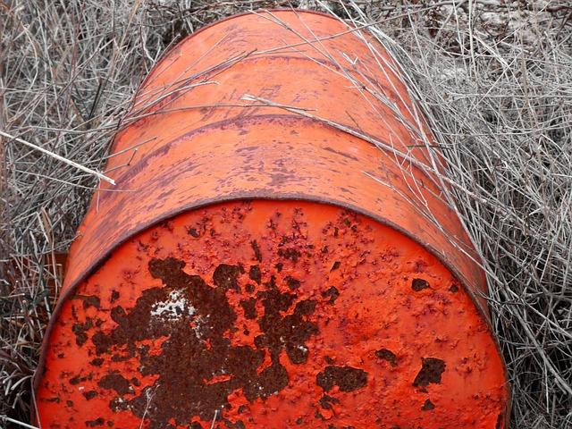

# Využití derivací v matematických modelech

>   * Procvičíme si interpretaci derivace jako rychlosti změny.
>   * Naučíme se sestavovat matematické modely situací, ve kterých se veličina mění nekonstantní rychlostí
>   * Prerekvizitou je schopnost chápat derivaci jako rychlost změny a umět matematicky vyjádřit úměrnost mezi veličinami.

## Tepelná výměna podle Newtonova zákona

\iffalse

\fi

Newtonův zákon ochlazování je možné použít pro tělesa, u nichž teplota je ve všech místech stejná a efekty spojené s vedením tepla jsou zanedbatelné. Takové objekty charakterizujeme nízkým Biotovým číslem (naučíte se v navazujících předmětech jako Fyzikální vlastnosti dřeva). Předpokládejme, že nevytápěná místnost tyto podmínky splňuje.

Teplota v místnosti kde se přestalo topit při teplotě
$T=23^\circ\mathrm{C}$ se mění tepelnou výměnou s okolím. Rychlost,
s jakou teplota místnosti v zimě klesá je úměrná rozdílu teplot
v místnosti a venku. Vyjádřete toto pozorování kvantitativně pomocí
derivací. Sestavíte tím matematický model popisující pokles teploty
v této místnosti.

_V tomto příkladu se učíme, že tam, kde se pracuje s rychlostmi změn hraje při kvantitativním popisu roli derivace. Ze střední školy známe tvary fyzikálních zákonů a vztahů v omezené platnosti, kdy se rychlost nemění (jako například  rovnoměrný pohyb) nebo mění jenom velmi speciálním způsobem (jako například  rovnoměrně zrychlený pohyb). Pomocí derivací tato omezení středoškolské fyziky padají._

Je-li $T$ teplota a $t$ čas, je veličina $\frac{\mathrm dT}{\mathrm dt}$ rychlost s jakou roste teplota a veličina $-\frac{\mathrm dT}{\mathrm dt}$ rychlost, s jakou teplota klesá. Podle předpokladů platí
$$
  -\frac{\mathrm dT}{\mathrm dt}=k(T-T_{\text{venku}})
$$
a model má tvar
$$
  \frac{\mathrm dT}{\mathrm dt}=-k(T-T_{\text{venku}}),\quad T(0)=23^\circ\mathrm{C}
$$
kde $k$ je konstanta úměrnosti a $T_{\text{venku}}$ teplota venku.

## Veličiny z rovnice vedení tepla

V případech, kdy je nutno uvažovat vedení tepla (vysoké Biotovo číslo), postupujeme podle rovnice vedení tepla, kterou jsme na přednášce odvodili pro jednorozměrný případ ve tvaru
$$\varrho c \frac{\partial T}{\partial t}=\frac{\partial}{\partial x}\Bigl(\lambda\frac{\partial T}{\partial x}\Bigr).$$  Typickým případem vedení tepla v jedné dimenzi je vedení tepla ve stěně. 

Uvažujme jednorozměrnou úlohu s vedením tepla. Osa $x$ směřuje doprava, teplota v bodě $x$ a čase $t$ je $T(x,t)$ ve stupních Celsia. Tok tepla v čase $t$ a v bodě $x$ je $q(x,t)$ v joulech za sekundu. Kladný tok je ve směru osy $x$.
Podle Fourierova zákona je $$q=-\lambda \frac{\partial T}{\partial x}.$$

Budeme uvažovat jednorozměrný objekt, tyč nebo stěnu. Počáteční teplota je $0\,^{\circ}\mathrm{C}$, pravý konec udržujeme na této teplotě, levý konec ohříváme na $20\,^{\circ}\mathrm{C}$ a udržujeme na této teplotě. Ve zbytku tyče (stěny) se postupně nastolí rovnováha vlivem vedení tepla.

Vyjádřete následující veličiny a určete jejich znaménko.

1.  Rychlost s jakou v daném místě a čase roste teplota jako funkce času.
1.  Rychlost s jakou v daném místě a čase roste teplota jako funkce polohy, tj. jak rychle  roste teplota směrem doprava.
1.  Rychlost s jakou klesá teplota jako funkce polohy, tj. směrem doprava.
1.  Rychlost se kterou roste (směrem doprava) tok tepla jako funkce polohy.
1.  Rychlost se kterou klesá (směrem doprava) tok tepla jako funkce polohy.

_Tato úloha je jednoduchá a vlastně není na počítání, ale jenom na ujasnění si toho, co derivace vyjadřují a kdy jsou kladné a kdy záporné. To je nutné znát při zadávání modelů do numerických simulací. Výpočet za člověka udělají počítače, ale slovní interpretaci ani kontrolu, že je model relevantní a nemá popletená znaménka, za člověka nikdo neudělá. Používáme postup všeobecně přijímaný ve fyzikálních modelech. To však někdy nekoresponduje s výpočetními nástroji. Například ANSYS, nejpoužívanější program na výpočet modelů typu rovnice vedení tepla, používá pro zadání okrajových podmínek nikoliv tok ven z tělesa, ale tok dovnitř tělesa. Tedy pro fyzika a výpočtáře mají tyto podmínky opačné znaménko. Proto je potřeba vědět co se počítá, jak se systém chová, jak se to projeví na jeho vlastnostech a potom zkontrolovat, jestli to tak vychází i vě výpočetním modelu, jestli nepočítáme něco nesmyslného._

Shrneme si, co je možné očekávát během průběhu děje. U studené tyče ohřejeme levý konec a teplotu udržujeme, pravý konec udržujmeme na nízké teplotě. Tyč se postupně ohřeje a pořád, během dosahování rovnováhy i po nastolení rovnováhy, bude blíž k teplému konci teplota vyšší. Směrem doprava tedy teplota bude klesat a tím směrem také poteče teplo. Po dodsažení rovnováhy bude toto teplo stejné, jako energie, kterou musíme na ohřívaném konci dodávat a na ochlazovaném konci odebírat. Než však nastane rovnováha, musí se všechny části tyče prohřát na cílovou teplotu. To znamená, že při předávání tepla směrem k chladnějšímu konci musí část tepla zůstat v daném místě jako vnitřní energie a projeví se zvýšením teploty. Do dosažení rovnovážného stavu tyč vede teplo, ale každá část tyče předává dál jenom část tepla, protože další část použije na zvýšení své teploty. Proto platí, že čím více jsme napravo, tím méně tam teče tepla. 

1. Rychlost, s jakou v daném místě a čase roste teplota jako funkce času je $\frac {\partial T}{\partial t}$ a tato derivace je v každém bodě kladná, protože tyč se ohřívá. Po čase se asi ustálí rovnováha a derivace bude nulová, teplota se přestane měnit. Měříme ve stupních Celsia za sekundu.
  $\left[\frac {\partial T}{\partial t}\right]={}^\circ\mathrm{C}\,\mathrm{s}^{-1}$
1. Rychlost, s jakou v daném místě a čase roste teplota jako funkce polohy, tj. jak rychle se roste teplota směrem doprava, je $\frac {\partial T}{\partial x}$ a tato derivace je záporná, protože vlevo je horký konec a teplota směrem doprava klesá. Měříme ve stupních Celsia na metr.
    $\left[\frac {\partial T}{\partial x}\right]={}^\circ\mathrm{C}\,\mathrm{m}^{-1}$
1. Rychlost s jakou klesá teplota jako funkce polohy, tj. směrem doprava, je $-\frac {\partial T}{\partial x}$ a tato veličina je kladná, protože vlevo je horký konec a teplota směrem doprava opravdu klesá. Měříme ve stupních Celsia na metr.
        $\left[-\frac {\partial T}{\partial x}\right]={}^\circ\mathrm{C}\,\mathrm{m}^{-1}$
1. Rychlost, se kterou roste (směrem doprava) tok tepla jako funkce polohy je $\frac {\partial q}{\partial x}$. Teplo teče doprava a přitom se spotřebovává, protože se ohřívá tyč. Proto tok klesá a parciální derivace je záporná.
  Měříme v joulech za sekundu na metr.
          $\left[\frac {\partial q}{\partial x}\right]=\mathrm{J}\,\mathrm{s}^{-1}\,\mathrm{m}^{-1}$
1. Rychlost, se kterou klesá (směrem doprava) tok tepla jako funkce polohy je $-\frac {\partial q}{\partial x}$ a tato veličina je kladná, což plyne z předchozího bodu a z toho, že jsme změnili znaménko. Tato veličina udává, kolik tepla za jednotku času ubude v toku na metrovém úseku tyče. Ze zákona zachování energie se toto teplo nemůže "ztratit", ale použije se na zvýšení teploty, což je právě obsahem rovnice vedení tepla. Měříme v joulech za sekundu na metr.
            $\left[-\frac {\partial q}{\partial x}\right]=\mathrm{J}\,\mathrm{s}^{-1}\,\mathrm{m}^{-1}$ 

## Okrajové podmínky pro rovnici vedení tepla

  K modelu stěny pomocí rovnice vedení tepla je ještě nutné přidat podmínky související s počátečním stavem (počáteční podmínky) a s chováním na okrajích (okrajové podmínky).

  Nechť stěna je na intervalu $x\in[0,L]$, $x=0$ je vnitřní okraj a $x=L$ je vnější okraj. Výraz $-k\frac{\partial T}{\partial x}$ udává tok tepla ve směru osy $x$. Tok ve směru osy $x$ má kladné znaménko. Naformulujte okrajové podmínky v následujících scénářích.

1.  Z venku dokonale izolovaná stěna. Na hranici $x=L$ nedochází k toku tepla.
1.  Vnitřní část stěny je udržovaná na konstantní teplotě $T=23^\circ \mathrm C$.
1.  Stěna je zvenku osvětlená a zahřívaná Sluncem. Na vnější hranici je konstantní tok tepla směrem do stěny.
1.  Stěna je zvenku ochlazována prouděním vzduchu. Tok tepla mezi stěnou a okolím je úměrný rozdílu teplot stěny a okolí.
1.  Stěna je zevnitř ohřívána prouděním vzduchu od radiátorů. Tok tepla mezi stěnou a okolím je úměrný rozdílu teplot stěny a okolí.

_Zpracováno podle Cengel: Mass and heat transfer._

Je-li podmínka na teplotu, figuruje v matematické formulaci $T$ vypočtená v bodě $x=0$ nebo $x=L$ podle toho, jedná-li se o vnitřní nebo vnější část stěny. 
$T$ je funkce polohy, tj. $T=T(x).$ Je-li podmínka na tok, figuruje v matematické formulaci tok ve tvaru $-k\frac{\partial T}{\partial x}$, opět vypočtená v jednom z krajních bodů.

1.  Nulový tok pro $x=L$ znamená $-k\frac{\partial T}{\partial x}(L)=0$, což je ekvivalentní $\frac{\partial T}{\partial x}(L)=0.$
1.  Teplota 23 stupňů pro $x=0$ znamená $T(0)=23$
1.  $-k\frac{\partial T}{\partial x}(L)=-Q$, kde $Q$ je teplo za jednotku času dodané ze Slunce. Jedná se o výkon Slunce dopadající na stěnu vynásobený koeficientem absorbce, protože část tepelného výkonu se odráží. Záporné znaménko je proto, že teplo teče do stěny, tj. proti směru osy $x$.
1.  $-k\frac{\partial T}{\partial x}(L)=h(T(L)-T_{\text{okolí}})$, kde $h$ je koeficient přestupu tepla.
1.  $-k\frac{\partial T}{\partial x}(0)=h(T_{\text{místnost}}-T(0))$, kde $h$ je koeficient přestupu tepla.

Všimněte si, že poslední dvě podmínky se liší znaménkem u $T$. To proto, že v jednom případě je kladný směr toku tepla do materiálu a jednou z materiálu. Pokud chceme mít popis jednotný, nebo nezávislý na zvolené souřadné soustavě, formulujeme podmínky pro tok tepla ven z materiálu. Tento tok získáme tak, že tok tepla vynásobíme skalárně s jednotkovým vektorem směřujícím ven z materiálu kolmo na jeho povrch. V tomto případě by pro tok ze stěny do místnosti bylo $k\frac{\partial T}{\partial x}(0)=h(T(0)-T_{\text{místnost}})$. Tento tok by byl záporný, protože ve skutečnosti teplo uniká z místnosti stěnou ven.

  

## Model růstu úměrného velikosti chybějícího množství

\iffalse

\fi

Mnoho
živočichů roste tak, že mohou dorůstat jisté maximální délky a
rychlost jejich růstu je úměrná délce, která jim do této maximální
délky chybí (tj. kolik ještě musí do této maximální délky
dorůst). Sestavte matematický model popisující takovýto růst
(von Bertalanffy growth model).

_Jakmile vidíme, že v zadání figuruje rychlost změny veličiny,
  která nás zajímá, je jasné, že kvantitativní model bude obsahovat
  derivaci. Zatím se učíme model zapsat, později ho budeme umět i vyřešit._

Je-li $L$ délka a $L_{\max}$ maximální délka, potom do maximální délky chybí  $L_{\max}-L$ a model má tvar $$\frac{\mathrm dL}{\mathrm dt}=k (L_{\max}-L).$$

## Kontaminace a čištění

\iffalse

\fi

Znečišťující látky se v kontaminované oblasti rozkládají tak, že za den se samovolně rozloží 
$8\%$ aktuálního znečištění. Kromě toho pracovníci odstraňují látky rychlostí $30$
galonů denně. Vyjádřete tento proces kvantitativně pomocí vhodného
modelu.

_Tento příklad opět zmiňuje rychlost změny, tj. derivaci. Tentokrát se na změně podílejí dva procesy a jejich účinek se sčítá. Příklad navíc připomíná, jak se pracuje se změnou vyjádřenou procenty. Toto je používané například při úročení spojitým úrokem. Pokud pokles změníme na růst, tj. pokud změníme
  znaménka u derivace, máme okamžitě model růstu financí na účtu, na kterém se pravidelně připisuje úrok a k tomu se přidává fixní úložka._

 

Je-li $y$ znečištění v galonech a $t$ čas ve dnech, má model tvar
$$\frac{\mathrm dy}{\mathrm dt}=-0.08y-30.$$

## Logistická rovnice: model využívání přírodních zdrojů

\iffalse

\fi 

Při modelování růstu populace o velikosti $x(t)$ často pracujeme s populací žijící v prostředí s omezenou úživností (nosnou kapacitou). Často používáme model $$\frac{\mathrm d x}{\mathrm dt}=rx\left(1-\frac xK\right),$$
kde $r$ a $K$ jsou parametry modelu (reálné konstanty).  Nakreslete
graf funkce $f(x)=rx\left(1-\frac xK\right)$ a ověřte, že pro velká
$x$ je $f(x)$ záporné a velikost populace proto klesá. Pokud populaci
lovíme konstantní rychlostí, sníží se pravá strana o konstantu, kterou
označíme $h$. Ukažte, že pro intenzivní lov bude pravá strana rovnice
pořád záporná a intenzivní lov tak způsobí vyhubení populace. Dá se
najít kritická hodnota lovu oddělující vyhynutí populace a její
trvalé přežívání?

_Toto je asi nejdůležitější rovnice pro modelování biologických jevů. Používá se při modelování vývoje obnovitelných zdrojů a bývá modifikována pro konkrétní případy podle toho, jak populace interaguje s okolím._

Funkce $f(x)=rx\left(1-\frac xK\right)$ je kvadratická funkce s nulovými body $x=0$ a $x=K$, vrcholem uprostřed mezi nulovými body (tj. pro $x=\frac K2$) a parabola je otočená vrcholem nahoru. Proto je napravo od $x=K$ záporná. To odpovídá tomu, že populace s velikostí přesahující nosnou kapacitu v dlouhodobém horizontu vymírá.

Funkce $f_h(x)=rx\left(1-\frac xK\right)-h$ vznikne posunutím funkce $f(x)=rx\left(1-\frac xK\right)$ o $h$ dolů. Pokud posuneme hodně, dostane se celá parabola pod osu $x$ a funkce bude pořád záporná. Kritická hodnota je v situaci, kdy mizí možnost, že $f_h(x)$ má body kde je kladná a populace se může rozvíjet. To nastane,  pokud se vrchol paraboly dostane na osu $x$, tj. $h$ je rovno funkční hodnotě funkce $f(x)$ v bodě $x=\frac K2.$

## Populace jelenů

\iffalse

\fi

Populace jelenů v národním parku přibývá rychlostí 10\% za
rok. Správa parku každý rok odebere 50 jedinců. Napište
matematický model pro velikost populace jelenů v tomto parku.

Je-li $x$ velikost populace jelenů, platí
$$
  \frac{\mathrm dx}{\mathrm dt}=0.10 x-50, 
$$
kde $t$ je čas v letech.

## Hrubý model chřipkové epidemie

Rychlost s jakou roste počet nemocných chřipkou je úměrný současně
počtu nemocných a počtu zdravých jedinců. Sestavte model takového
šíření chřipky.

_Toto je současně model popisující šíření informace v populaci, stačí si místo chřipky představit nějakou informaci předávanou mezi lidmi (sociální difuze)._

Je-li $M$ velikost populace a $y$ počet nemocných, je v populaci $M-y$ zdravých a model má tvar
$$\frac{\mathrm dy}{\mathrm dt}=ky(M-y).$$

## Ropná skvrna

\iffalse

\fi

Kruhová ropná skvrna na hladině se rozšiřuje
tak, že její poloměr jako funkce času roste rychlostí, která je
nepřímo úměrná druhé mocnině poloměru. Vyjádřete proces kvantitativně
pomocí derivací.

Je-li $r$ poloměr, je $r^2$ druhá mocnina a protože se jedná o nepřímou úměrnost, platí
$$\frac{\mathrm dr}{\mathrm dt}=\frac{k}{r^2}.$$

## Model učení

Rychlost učení (tj. časová změna objemu
osvojené látky nebo procento z maximální manuální zručnosti) je úměrná
objemu dosud nenaučené látky. Vyjádřete proces kvantitativně pomocí
derivací.

Je-li $L$ objem naučené látky a $L_{\max}$ maximální objem látky kterou je možné se naučit, je objem dosud nenaučené látky $L_{\max}-L$ a model má tvar
$$\frac{\mathrm dL}{\mathrm dt}=k (L_{\max}-L).$$

## Výpočet derivace

Určete derivace následujících funkcí jedné proměnné. Ostatní veličiny jsou parametry. Pokud v zadaném vzorci odhalíte vztah mezi veličinami známý ze středoškolské geometrie, pokuste se najít odpovídající interpretaci derivace.

1.  $V(r)=\frac 43\pi r^3$ 
1.  $S(r)=4\pi r^2$ 
1.  $A(r)=\pi r^2$
1.  $V(h)=\frac 13 \pi r^2h$
1.  $S(a)=6a^2$
1.  $U(v)=\frac 12 mv^2$
1.  $V(r)=\frac {a}{r^2}$  
1.  $f(y)=ae^{by}$
1.  $S(r)= 2\pi r^2 + 2\pi r h$
1.  $S(h)= 2\pi r^2 + 2\pi r h$
1.  $S(a)= \frac 12(a+c)v$
1.  $L(r)= 2\pi r$

_V tomto příkladě se učíme mimo jiné derivovat i podle jiné proměnné než podle $x$. To je nezbytné pro aplikace. Abychom nebyli fixováni na proměnnou $x$, je vhodné se učit vzorce pro derivování vyjadřovat slovně a bez jména konkrétní proměnné._

1.  $\frac{\mathrm dV}{\mathrm dr}=4\pi r^2$, rychlost změny objemu koule při změnách poloměru, tj. změna objemu koule vztažená k jednotkové změně poloměru
1.  $\frac{\mathrm dS}{\mathrm dr}=8\pi r$, rychlost změny povrchu koule při změnách poloměru, tj. změna povrchu koule vztažená k jednotkové změně poloměru
1.  $\frac{\mathrm dA}{\mathrm dr}=2\pi r$, rychlost změny obsahu kruhu při změnách poloměru, tj. změna obsahu kruhu vztažená k jednotkové změně poloměru
1.  $\frac{\mathrm dV}{\mathrm dh}=\frac 13\pi r^2$, rychlost změny objemu kužele při změnách výšky, tj. změna objemu kužele vztažená k jednotkové změně výšky při zachovaném poloměru podstavy
1.  $\frac{\mathrm dS}{\mathrm da}=12a$, změna povrchu krychle vyvolaná jednotkovou změnou délky hrany krychle
1.  $\frac{\mathrm dU}{\mathrm dv}=mv$ 
1.  $\frac{\mathrm dV}{\mathrm dr}=-2\frac{a}{r^3}$
1.  $\frac{\mathrm df}{\mathrm dy}=abe^{by}$
1.  $\frac{\mathrm dS}{\mathrm dr}=4\pi r+2\pi h$, 
1.  $\frac{\mathrm dS}{\mathrm dr}=2\pi r$, 
1.  $\frac{\mathrm dS}{\mathrm da}=\frac 12v$,
1.  $\frac{\mathrm dL}{\mathrm dr}=2\pi$, 

