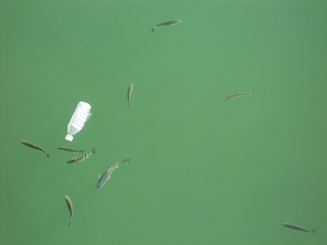

# Integrály II

## Výpočet integrálu substitucí

Najděte následující integrály integrováním substituční metodou.

<!-- 
% \item \priklad (x+1)\cos x.
% \item \priklad (x-1)e^{-x}.
% \item \priklad x^2\ln x.
% %\item \priklad x^2\sin x.
% \item \priklad x\sin(x^2).
-->

1. $\int x e^{x^2}\mathrm dx$
1. $\int  e^{-ax}\mathrm dx$
1. $\int \frac x{x^2+1}\mathrm dx$
1. $\int \sin x\cos^5x\mathrm dx$
1. $\int \cos x\sqrt{\sin x}\mathrm dx$

<!--
%\item \priklad \frac {\mathop{\mathrm{arctg}} x}{x^2+1}.
%\item \priklad \frac 1{1+\sqrt x}.
%\item \priklad \frac 3{5x-1}.
%\item \priklad \frac{x^2}{x^3-1}.
%\item \priklad \frac{x+1}{x^2+1}.
%\item \priklad x^2 e^x.
-->

```{prf:example} Řešení
:class: dropdown
:nonumber:

V integrované funkci se snažíme "rozšifrovat" součin složené funkce a
derivace vnitřní složky. Pokud se to podaří, dáváme substituci
takovou, že vnitřní složka složené funkce bude novou proměnnou. V
prvním případě je složenou funkcí exponenciální funkce, která má
vnitřní složku $x^2$. Derivace funkce $x^2$ je $2x$ a toto hledáme v
součinu se složenou funkcí. Část s proměnnou $x$ vidíme na začátku
integrované funkce. Dvojku ve funkci nemáme, ale to je naštěstí jenom
multiplikativní konstanta s takovou konstantou si dokážeme
poradit. Viz níže.

1. Integrál vypočteme substitucí $$x^2=t,$$ odkud plyne $$2x\,\mathrm dx=\mathrm dt$$ a $$x\,\mathrm dx=\frac 12 \mathrm dt.$$ S touto substitucí dostáváme 
$$\int x e^{x^2}\mathrm dx = \frac 12 \int e^t\mathrm dt.$$
Nyní vypočítáme integrál v proměnné $t$ a odsud
$$\int x e^{x^2}\mathrm dx = \frac 12 e^t =\frac 12 e^{x^2}+C.$$
1. Integrál vypočteme substitucí $$-ax=t,$$ odkud plyne $$-a\,\mathrm dx=\mathrm dt$$ a $$\mathrm dx=-\frac 1a \mathrm dt.$$ S touto substitucí dostáváme 
$$\int  e^{-ax}\mathrm dx = -\frac 1a \int e^t\mathrm dt.$$
Nyní vypočítáme integrál v proměnné $t$ a odsud
$$\int e^{-ax}\mathrm dx = -\frac 1a e^t =-\frac 1a e^{-ax}+C.$$
1. Integrál vypočteme substitucí $$x^2+1=t,$$ odkud plyne $$2x\,\mathrm dx=\mathrm dt$$ a $$x\,\mathrm dx=\frac 12 \mathrm dt.$$ S touto substitucí dostáváme 
$$\int  \frac{x}{x^2+1}\mathrm dx = \frac 12 \int \frac 1t \mathrm dt.$$
Nyní vypočítáme integrál v proměnné $t$ a odsud
$$\int  \frac{x}{x^2+1}\mathrm dx = \frac 12 \ln|t| =\frac 12 \ln(x^2+1)+C.$$
1. Integrál vypočteme substitucí $$\cos x=t,$$ odkud plyne $$-\sin x\,\mathrm dx=\mathrm dt$$ a $$\sin x\,\mathrm dx=- \mathrm dt.$$ S touto substitucí dostáváme 
$$\int  \sin x\cos^5 x\,\mathrm dx = - \int t^5 \mathrm dt.$$
Nyní vypočítáme integrál v proměnné $t$ a odsud
$$\int  \sin x\cos^5 x\,\mathrm dx  =- \frac 16 t^6 =-\frac 16 \cos^6 x+C.$$
1. Integrál vypočteme substitucí $$\sin x=t,$$ odkud plyne $$\cos x\,\mathrm dx=\mathrm dt.$$ S touto substitucí dostáváme 
$$\int  \cos x\sqrt{\sin x}\,\mathrm dx = \int \sqrt t \,\mathrm dt.$$
Nyní vypočítáme integrál v proměnné $t$ a odsud
$$\int  \cos x\sqrt{\sin x}\,\mathrm dx  = \frac 23 t^{3/2} = \frac 23 \sin^{3/2} x+C.$$

Kontrola [zde](https://sagecell.sagemath.org/?z=eJwljMEKwjAQRO-F_sPcuolVUfAi9EvESiiJBiGpSdT9fDfmMvvYN8zHJBrMoPrOvcNzsdOFteWVeD6qEZW2RrMg7-tvcxDMPhArvcQsZz6NaKTzKxVqUl1lMCY4-IC2fO47wN18KJPbSdp7MsVKF6gmP-IX9PfqBxQILQY=&lang=sage&interacts=eJyLjgUAARUAuQ==).

```

## Střední hodnota funkce

Určete střední hodnotu funkce na zadaném intervalu.

1. funkce $\sqrt x$ na intervalu $[1,4]$
1. funkce $\sin x$ na intervalu $[0,\pi]$
1. funkce $\sin x$ na intervalu $[0,2\pi]$
1. funkce $ax^2$ na intervalu $[0,1]$

V posledním příkladě určete hodnotu konstanty $a$ tak, aby střední hodnota byla rovna jedné.

## Vedení tepla stěnou, lineární materiálové vztahy

Tok tepla v jedné dimenzi je dán Fourierovým zákonem $$Q=-k\frac{\mathrm dT}{\mathrm dx}.$$ Pro ustálené proudění je $Q$ konstantní. Pro homogenní materiál s lineární odezvou je výše uvedený vztah přesně lineární, tj. $k$ je konstanta. Určete tok tepla stěnou šířky $d$ oddělující prostory o teplotě $T_1$ a $T_2$.

```{prf:example} Řešení
:class: dropdown
:nonumber:

Vztah
$$Q=-k\frac{\mathrm dT}{\mathrm dx}$$
udává derivaci teploty podle polohy ve tvaru
$$\frac{\mathrm dT}{\mathrm dx}=-\frac Qk$$
a integrací na intervalu $x\in [0,d]$ dostáváme
$$T(d)-T(0)=\int _0^d -\frac Qk\,\mathrm dx=-\frac Qk\int _0^d \mathrm dx=
-\frac Qk d.$$
Pro $T(0)=T_1$ a $T(d)=T_2$ dostáváme
$$T_2-T_1=-\frac Qk d$$
a odsud
$$Q=k\frac{T_1-T_2}d$$

```

## Vedení tepla stěnou, nelineární materiálové vztahy

Zopakujte předchozí výpočet pro materiál s nelineární materiálovou odezvou, kdy Fourierův zákon není lineární, tj. $k$ závisí na teplotě. Nejjednodušší zobecnění je případ, kdy $k(T)$ je lineární, tj. platí $$k(T)=a+bT.$$ Použijte substituční metodu převádějící integrál $\int k(T(x))\frac{\mathrm dT}{\mathrm dx}\,\mathrm dx$ na integrál $\int k(T)\,\mathrm dT.$ Použijte dále skutečnost, že střední hodnota lineární funkce je aritmetickým průměrem hodnot v krajních bodech intervalu.

Na tomto příkladě jsou zajímavé tři věci.

* Odvodíme vzorec používaný při posuzování tepelných
    ztrát. 
* Přirozeně vychází vzorec, který po
    zavedení střední hodnoty funkce $k(T)$ splývá se vzorcem z
    předchozího příkladu, odvozeného pro konstantní
    vodivost. 
* Nejzajímavější je fakt, že jsme substituční metodou
    vypočítali integrál funkce, kterou vlastně vůbec neznáme. Vskutku,
    neznáme teplotní profil $T(x)$ ve stěně a tím pádem neznáme ani
    závislost vodivosti $k(T(x))$ na poloze a ani gradient
    teploty. Přesto se podařilo integrál vypočítat. Teplotní profil se naučíme hledat jako řešení rovnice vedení tepla.

```{prf:example} Řešení
:class: dropdown
:nonumber:

Stejně jako v předchozím příkladě, máme
$$k(T)\frac{\mathrm dT}{\mathrm dx}=-Q$$
a integrací na intervalu $[0,d]$ dostáváme
$$\int_0^d k(T)\frac{\mathrm dT}{\mathrm dx}\,\mathrm dx=-Qd$$
a po substituci a označení $T(0)=T_1$, $T(d)=T_2$
$$\int_{T_1}^{T_2} k(T)\,{\mathrm dT}=-Qd.$$
S využitím střední hodnoty dostáváme
$$(T_2-T_1)\frac{k (T_1)+k (T_2)}2=-Qd$$
a po výpočtu
$$Q=\frac{k (T_1)+k (T_2)}{2}\frac{T_1-T_2}{d}.$$

```

## Střední hodnota funkce dané tabulkou

\iffalse 


\fi 

Určete střední hodnotu koeficientu tepelné vodivosti $\lambda$ mědi na teplotním intervalu od 100 do 400 Kelvinů. Porovnejte výsledek s aritmetickým průměrem.

Pro výpočet na intervalu od 100 do 800 Kelvinů bychom museli integrovat na intervalu, na kterém nemáme rovnoměrně rozložené uzlové body. Navrhněte, jak v takovém případě postupovat a jak vypočítat $\int_{100}^{800}\lambda(T)\,\mathrm dT$

|  $T/\mathrm{K}$ | $\lambda/ (\mathrm{W}/(\mathrm{m}\,\mathrm{K}))$ |
|-|-|
|  100 | 482 |
|  200 | 413 |
|  300 | 401 |
|  400 | 393 |
|  600 | 379 |
|  800 | 366 |

Table: Zdroj: Cengel, Mass and heat transfer.

```{prf:example} Řešení
:class: dropdown
:nonumber:

Integrál vypočteme lichoběžníkovým pravidlem
$$\int_{100}^{400}\lambda(T)\,\mathrm dT\approx
\frac {100}2(482+2\times 413+2\times401+393)=125150$$

Střední hodnota na intervalu $[100,400]$ je
$$\frac{1}{300}\int_{100}^{400}\lambda(T)\,\mathrm dT \approx 417$$

Aritmetický průměr je
$$\frac{482+413+401+393}4=422.$$

Střední hodnota je vlastně (po dosazení lichoběžníkového pravidla)
$$\frac {482+2\times 413+2\times401+393}6$$
a jedná se tedy o vážený průměr, kdy vnitřní body jsou započteny dvojnásobnou vahou.

Integrál na intervalu $[100,800]$ vypočteme díky aditivitě vzhledem k
integračnímu oboru
$$\int_{100}^{800}\lambda(T)\,\mathrm dT=\int_{100}^{400}\lambda(T)\,\mathrm dT+\int_{400}^{800}\lambda(T)\,\mathrm dT$$
a pro každý integrál máme data v ekvidistantních krocích a můžeme
použít přímo lichoběžníkové pravidlo.

```

## Růst populace a přežívání jedinců

<div class="shorten" data-text="Trošku náročnější aplikace integrálu. Je zadána rychlost růstu populace a zajímá nás cílový stav. Tohoto cílového stavu se však dožije z každé kohorty jenom určité procento jedinců.">

\iffalse 



\fi 

Populace živočišného druhu
činí 5600 jedinců a tato populace roste rychlostí
$$R(t)=720 e^{0.1t}$$ jedinců za rok. (V tomto čísle je zahrnuta
přirozená natalita, mortalita a povolený lov.) Vlivem znečištění
životního prostředí se však jedinci dožívají kratšího věku, než je
zahrnuto v popsaném modelu. Zlomek populace, který přežije časový interval délky $t$,
je $$S(t)=e^{-0.2t}.$$ Odhadněte počet živočichů za 10 let a
odhadněte, jaký by tento počet byl, kdyby k  žádnému znečištění
nedocházelo, tj. kdyby bylo $S(t)=1$.

Napište jenom příslušné integrály a okomentujte, jakými metodami
bychom je počítali. Vlastní výpočet provádět nemusíte.

_(Podle J. Stewart, T. Day: Biocalculus,  Calculus for Life Sciences.)_

<!--
% var('t')
% S(t)=exp(-0.2*t)
% print 5600+integrate(720*exp(0.1*t),(t,0,10))
% print 5600*S(10)+integrate(720*exp(0.1*t)*S(10-t),(t,0,10))
-->

```{prf:example} Řešení
:class: dropdown
:nonumber:

Nechť výchozí stav je rok $t=0$.

Bez znečištění:
Pokud je $N(t)$ počet jedinců po roce $t$, platí
$$N(10)=N(0)+\int_0^{10} R(t)\,\mathrm dt=5600+\int_0^{10} 720 e^{0.1 t}\,\mathrm dt=
5600+\left[7200 e^{0.1t}\right]_0^{10}\approx 18000,
$$
kde integrál se dá vypočítat přímou integrací pomocí vzorce.

Se znečištěním: Jedinci, kteří jsou v populaci na začátku, musí přežít 10 let, to znamená, že se jejich počet sníží na $S(10)$-násobek. Jedinci, kteří se narodí v roce $t$ musí přežít $10-t$ let a to znamená, že jejich počet se sníží na $S(10-t)$-násobek. Toto snížení musíme započítat do předchozího modelu bez znečištění a dostaneme
$$
\begin{aligned}
N(10)&=N(0)S(10)+\int_0^{10} R(t)S(10-t)\,\mathrm dt=\\&=5600 e^{-2}+\int_0^{10} 720 e^{0.1 t}e^{-0.2(10-t)}\,\mathrm dt\\&=
5600 e^{-2}+720 e^{-2} \int_0^{10}  e^{0.3 t}\,\mathrm dt=
\cdots =7000,
\end{aligned}
$$
kde i tento integrál se dá vypočítat přímou integrací pomocí vzorce.

```

</div>

## Rodičovské stromy

<div class="shorten" data-text="Další trošku náročnější aplikace integrálu. Jak je v úlohách na integrál obvyklé, potřebujeme posčítat příspěvky k aditivní veličině, jejíž hodnota nás zajímá. V tomto případě potřebujeme posčítat příspěvky z kruhové oblasti okolo stromu.">

\iffalse 


\fi 

Při obnově lesů je nutné velké množství
sadebního materiálu. Kromě školek hrají při obnově lesa důležitou roli
rodičovské stromy. Plošná hustota semen (například v počtu semen na
metr čtvereční) ve vzdálenosti $r$ od stromu je dána
funkcí $$D(r)=D_0 e^{-r^2/a^2}.$$ Pro vhodnou volbu jednotek dosáhneme
toho, že platí $a=1$. Pracujme proto s funkcí
$$D(r)=D_0 e^{-r^2}.$$ Určete množství semen uvnitř kruhu o poloměru $R$.

Napište jenom příslušný integrál a okomentujte, jakou metodou bychom
ho počítali. Vlastní výpočet provádět nemusíte.

_(Volně přeformulováno podle L. Edestein--Keshet: Differential calculus
for the life sciences. Příklad je použitelný pro stromy s velkými semeny, například dub. Pro jiné stromy musí semena sbírat stromolezci.)_

```{prf:example} Řešení
:class: dropdown
:nonumber:

Množství semen na metr čtvereční závisí na vzdálenosti od
stromu, je to tedy podobná úloha jako úloha s prouděním tekutiny
potrubím v přednášce. Postupujeme analogicky, jenom místo rychlosti tekutiny
máme hustotu semen.  Množství je součin hustoty a obsahu, $N=S\cdot D$. Protože $D$ není na celém obsahu konstantní, rozdělíme na části, kde konstantní je, a příspěvky sečteme, tj. $$N=\sum_{kruh} D\cdot\Delta S.$$ Protože $D$ je funkce $r$, potřebujeme sčítat (integrovat) přes $r$. Proto kruh dělíme na mezikruží a přes tato mezikruží sčítáme, tj. 
$$N=\sum_{kruh} D \frac{\Delta S}{\Delta r}\Delta r.$$ Limitním přechodem uděláme skok v součtu nekonečně malý a součet přejde na integrál, podíl změn přejde na derivaci, tj. dostaneme
$$N=\int_{kruh} D \frac{\mathrm dS}{\mathrm dr}\,\mathrm d r.$$
Obsah $S=\pi r^2$
roste s poloměrem, $\frac {\mathrm dS}{\mathrm dr}=2\pi r$. Po dosazení této derivace a po dosazení za $D$ a vyjádření toho, co znamená integrál přes kruh o poloměru $R$ získáme integrál
$$N=\int _0^R D_0e^{-r^2}2\pi r\,\mathrm dr,$$
který můžeme vypočítat pomocí substituce $-r^2=t$.

```

</div>


