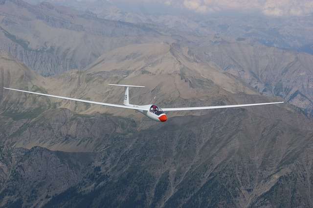
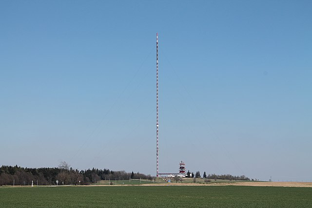
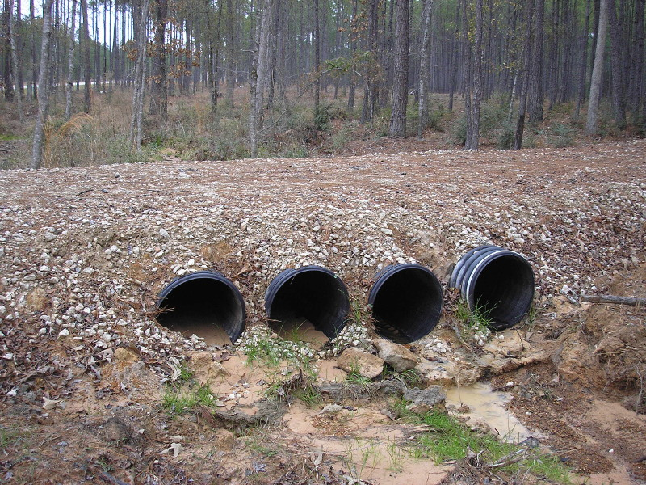
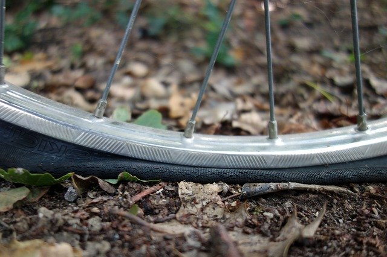

# Archiv


## Pokles hladiny podzemní vody při ustáleném rovinném proudění

\label{pokles}
Stavovou veličinou pro popis podzemní vody je \textit{piezometrická
  hladina} $h$ měřená v metrech (hrubá představa může být hladina
spodní vody nebo, v případě že je shora ohraničení nepropustnou
vrstvou, tak hladina, kam by vystoupila voda ve vrtu). Prostor, kde
voda teče, se nazývá \textit{zvodeň} (aquifer).
Proudění řídí \textit{Darcyho zákon}, který
  vyjadřuje, že \textit{filtrační rychlost} $v_f$ podzemní vody je úměrná
  sklonu piezometrické hladiny, tj. rychlosti, s jakou klesá
  piezometrická hladina jako funkce $x$.

  \vspace*{-15pt}
\begin{enumerate}[A)]\itemsep 0 pt
\item Zapište Darcyho zákon kvantitativně pomocí derivace piezometrické hladiny. 
\item Tok je dán součinem filtrační rychlosti a obsahu plochy kolmo na
  rychlost. Uvažujte obdélníkovou plochu $h\times 1$, která je na výšku přes celou
  zvodnělou vrstvu $h$ a na šířku má jednotkovou délku. Vynásobte její obsah 
  filtrační rychlostí a dostanete \textit{průtok na jednotku šířky}, označovaný
  $q$. Pro ustálené proudění je $q$ konstantní.
\item Výsledný vztah z předchozího bodu chápejte jako diferenciální rovnici s neznámou funkcí $h$ jako funkcí $x$ a řešením rovnice najdete křivku snížení hladiny podzemní vody v podélném profilu. 
\end{enumerate}

(\textit{Podle Dana Říhová a Jana Marková, Poznámky k přednáškám z Hydrauliky, přednáška č. 9.})

```{prf:example} Řešení
:class: dropdown
:nonumber:

\begin{enumerate}[A)]
  \item  $$v_f=-k\frac{\mathrm dh}{\mathrm dx}$$
  \item $$q=-kh\frac{\mathrm dh}{\mathrm dx}$$
  \item $$
    \begin{aligned}
      q\,\mathrm{d}x&=-kh\,\mathrm dh\\
      \int q\,\mathrm{d}x&=-k \int h\,\mathrm dh\\
      qx&=-\frac k2 h^2+C
    \end{aligned}
    $$
    V souřadnicích, kdy osa $x$ směřuje doprava a $h$ nahoru, se jedná
    se o parabolu "otočenou vrcholem směrem doprava".
\end{enumerate}
```


## Studna s volnou hladinou

Uvažujme diferenciální rovnici
\begin{equation}
q=-kh\frac{\mathrm dh}{\mathrm dx} \tag{*}\label{*}
\end{equation}
odvozenou v \ref{pokles} B. Tentokrát budeme studovat studnu s volnou hladinou\footnote{Zjednodušeně, voda ve studni je na úrovni hladiny podzemní vody. Studna nevznikla navrtáním nepropustné vrstvy, kdy by byla voda natlakovaná a vystoupila do výšky odpovídající tomuto tlaku.} Je-li studna čerpána konstantní rychlostí $Q$, je tok na jednotku délky na kružnici o poloměru $x$ roven $q=-\frac {Q}{2\pi x}$ (voda teče dovnitř, tj. ve směru ve kterém klesá $x$). Dosaďte tento vztah do rovnice \eqref{*} a rovnici vyřešte s počáteční podmínkou $h(R)=H$, kde $H$ odpovídá hladině vody ve studni a $R$ je poloměr studny (na obrázku $h_w$ a $r_w$). Dostanete rovnici \textit{snížení hladiny v okolí studny} čerpané rychlostí $Q$ (depresní křivka).
(\textit{Volně podle Dana Říhová a Jana Marková, Poznámky k přednáškám z Hydrauliky, přednáška č. 9. Analogickým způsobem se počítají tepelné ztráty při prostupu tepla válcovou stěnou (viz \url{https://youtu.be/rvyogmaUmUQ}).})

```{prf:example} Řešení
:class: dropdown
:nonumber:

$$
\begin{aligned}
  -\frac{Q}{2\pi x}&=-kh\frac{\mathrm dh}{\mathrm dx}\\
%  \frac{Q }{2\pi x}\,\mathrm {d}x&=kh\,\mathrm d h\\
  \frac{Q }{2\pi} \int \frac{\mathrm {d}x}{x}&=k\int h\,\mathrm d h\\
  \frac{Q }{2\pi}\ln x&=k \frac {h^2}2 +c\\
\text{obecné řešení: }  \frac{Q }{\pi}\ln x&=k {h^2} +C\\
\text{z počáteční podmínky: }  \frac{Q }{\pi}\ln R&=k {H^2} +C\\
  C&=\frac{Q }{\pi}\ln R-k {H^2}\\
\text{po dosazení do obecného řešení: }   \frac{Q }{\pi}\ln x&=k {h^2} +\frac{Q }{\pi}\ln R-k {H^2}\\
\text{po úpravě: }  \frac{Q }{k\pi}\ln \frac {x}{R}&={h^2} - {H^2}\\
\end{aligned}
$$
Tento vztah umožňuje například navrhnout průměr studny, odhadnout
vydatnost studny, nebo pomocí odčerpávaného vrtu a menších pomocných
vrtů sledujících pokles hladiny v okolí odčerpávaného vrtu stanovit
filtrační součinitel $k$. Využití vzorce
$$
  \frac{Q }{k\pi}\ln \frac {x}{R}={h^2} - {H^2}
$$
je však mnohem rozmanitější,
umožňuje vypočítat poměry ve stavebních jámách a v jejich okolí. To je
užitečné například při odhadu, kolik vody se hromadí ve výkopu. Další
využití je, že dokážeme odhadnout vliv stavební jámy na hydrologické
poměry v okolí a tyto poměry dokážeme měnit a přizpůsobovat našim
potřebám. Častou aplikací je například hydraulická clona (soustava
prvků rozmístěných a provozovaných tak, aby nedocházelo k šíření kontaminace z chemické výroby do vodárensky využívaných vod).

```


## Rychlost klesání kluzáku
Teplota klesá s výškou o $2^\circ \mathrm C$ na kilometr. Pilot
kluzáku vidí, že teplota v okolí jeho kluzáku roste rychlostí
$10^{-3}{}^\circ \mathrm C/\mathrm{s}$. Vyjádřete tato pozorování pomocí
derivací a určete, jak rychle ztrácí kluzák výšku. Návod: Uvažujte složenou funkci $T(h(t))$ a hledejte její derivaci podle času.

\textit{Tento příklad ukazuje, že pravidlo pro derivaci složené funkce je logické. V tomto případě vlastně přepočítává klesání z jednotek stupně Celsia za sekundu na jednotky kilometr výšky za sekundu. Můžete si to zkusit na prstech nebo pomocí trojčlenky a dojdete k tomu stejnému, k čemu pomocí derivace funkce. Při měnících se rychlostech výpočet pomocí trojčlenky použitelný není, pravidlo pro derivaci složené funkce je však k dispozici vždy.}

```{prf:example} Řešení
:class: dropdown
:nonumber:

Je-li $h$ výška, $T$ teplota a $t$ čas, můžeme zadání přepsat do tvaru
$$
  \frac{\mathrm dT}{\mathrm dh}=-2^\circ\mathrm C/\mathrm{km}, \quad
  \frac{\mathrm dT}{\mathrm dt}= 10^{-3}{}^\circ\mathrm C/\mathrm{s}, \quad
  \frac{\mathrm dh}{\mathrm dt}=?.
$$
Vzorec pro derivaci složené funkce $T(h(t))$ dává
$$
  \frac{\mathrm dT}{\mathrm dt} = \frac{\mathrm dT}{\mathrm dh} \cdot \frac{\mathrm dh}{\mathrm dt}
$$
a odsud
$$
  \frac{\mathrm dh}{\mathrm dt} = \frac{\frac{\mathrm dT}{\mathrm dt}}{\frac{\mathrm dT}{\mathrm dh}}
$$
a numericky
$$
  \frac{\mathrm dh}{\mathrm dt} = -\frac{10^{-3}}{2}=-5\cdot 10^{-4}\, \mathrm{km}\,\mathrm{s^{-1}}=-0.5 \,\mathrm{m}\,\mathrm{s}^{-1}.
$$
Kluzák klesá rychlostí půl metru za sekundu. To odpovídá i "selskému rozumu", kdy uvažujeme tak, že jeden stupeň Celsia odpovídá půl kilometru, tj. 500 metrů. Za jednu sekundu klesne teplota podle zadání o $10^{-3}{}^\circ\mathrm{C}$, což je tisícina z jednoho stupně a tomu odpovídá tisícina z 500 metrů, tedy půl metru. Příklady, které si můžeme alespoň orientačně zkontrolovat výpočtem založeným na "selské logice" jsou obzvlášť cenné, protože nám dávají jistotu nutnou při použití v aplikacích, kde úvaha na provedení výpočtu bez derivací není reálná. 

```

 ## Změna tlaku a lupání v uších
V dopravním prostředku, který se pohybuje do kopce nebo z kopce, se
mění tlak. Tím vznikne tlakový rozdíl mezi vnějším tlakem a tlakem ve
středním uchu. Vyrovnání tlaku při rychlé změně se projeví lupnutím
v uších.  Lupnutí tedy nastane, pokud je derivace
$\frac {\mathrm d p}{\mathrm dt}$ velká. (Velká v absolutní hodnotě,
tj. numericky hodně kladná nebo hodně záporná.)  Tuto veličinu však je
těžké měřit. Umíme měřit změnu nadmořské výšky $u$ a víme, jak se tlak
$p$ mění s nadmořskou výškou. Nechť například
$\frac{\mathrm dp}{\mathrm
  du}=-0.12\,\mathrm{g}\,\mathrm{cm}^{-2}\mathrm{m}^{-1}$ (údaj
meteorologů) a vezměme
$ \frac{\mathrm du}{\mathrm
  dt}=-3\,\mathrm{m}\,\mathrm{s}^{-1}$. Okomentujte význam toho, že
derivace jsou záporné a určete rychlost, s jakou rychlostí se mění
tlak vzduchu.

\textit{Toto je jenom jednodušší obměna příkladu s kluzákem.}

```{prf:example} Řešení
:class: dropdown
:nonumber:
 Derivace jsou záporné, protože tlak s rostoucí výškou klesá a
nadmořská výška klesá s časem (vozidlo jede z kopce).
Pomocí derivace složené funkce platí
$$\frac{\mathrm dp}{\mathrm dt}=\frac{\mathrm dp}{\mathrm du} \cdot \frac{\mathrm du}{\mathrm dt}=-0.12
\,\mathrm{g}\,\mathrm{cm}^{-2}\mathrm{m}^{-1}\times
(-3\,\mathrm{m}\,\mathrm{s}^{-1})
=0.36 \,\mathrm{g}\,\mathrm{cm}^{-2}\mathrm{s}^{-1}.
$$
Tlak roste rychlostí $0.36$ gramů na centimetr čtvereční za sekundu.
```

## Kužel s předepsaným tvarem
\label{kuzel}

Kužel má poměr poloměru podstavy $r$, výšky $h$ a délky strany $s$ ve tvaru $$r:h:s=3:4:5.$$ Kužel může měnit velikost, ale tento poměr zůstává zachován. (To odpovídá například skladování sypkého materiálu na hromadě nebo skladování tekutiny v trychtýřovitém zásobníku.) Objem a povrch pláště jsou $V=\frac 13 \pi r^2 h$ a $S=\pi rs$. Z úvah o podobnosti na přednášce víme, že vzorce pro objem a obsah musí být pro vhodné konstanty $a$, $b$, $c$ tvaru
$$V=ar^3,\ S=br^2,\ S=cV^{2/3}.$$
Potvrďte tyto obecné závěry pro náš konkrétní případ přímým výpočtem a použitím uvedených vzorců a poté vypočtěte a podejte interpretaci derivací $$\frac{\mathrm dV}{\mathrm dr},\ \frac{\mathrm dS}{\mathrm dr}.$$

\textit{Na tomto příkladě si ověříme platnost pouček, které jsme si na přednášce zmínilo o objemech a površích těles, které jsou si navzájem podobné, tj. vznikají jenom vhodným zvětšením nebo zmenšením stejného referenčního objektu.}

```{prf:example} Řešení
:class: dropdown
:nonumber:

Ze zadání víme, že platí $s=\frac 53 r$ a $h=\frac 43 r$ a přímým dosazením vidíme
$$V=\frac 13 \pi r^2 \frac 43 r=\frac 49 \pi r^3$$
a
$$S=\pi r \frac 53 r=\frac 53 \pi r^2.$$
Derivováním dostáváme
$$
\frac{\mathrm dV}{\mathrm dr}=\frac 43 \pi r^2
$$
a 
$$
\frac{\mathrm dS}{\mathrm dr}=\frac {10}3 \pi r.
$$
Tyto derivace vyjadřují změnu objemu a povrchu pláště kužele, pokud se kužel zvětší tak, že poloměr podstavy vzroste o jednotku.

Z rovnice pro objem dostáváme
$$r=\left(\frac {9}{4\pi}\right)^{1/3}V^{1/3}$$ a po dosazení
$$S=\frac 53 \pi r^2 = \frac 53 \pi \left(\frac {9}{4\pi}\right)^{2/3}V^{2/3}
=5\pi^{1/3}\left (\frac 3{16}\right)^{1/3} V^{2/3}$$

```

## Chemická směs Chemikálii rozpouštíme v nádrži tak, že do
nádrže pumpujeme vodu a směs odčerpáváme. Objem směsi roste podle
vztahu $20+2t$. Množství chemikálie $y$ klesá rychlostí, která je
úměrná $y$ a nepřímo úměrná objemu roztoku v nádrži.
Vyjádřete proces kvantitativně pomocí derivací.

```{prf:example} Řešení
:class: dropdown
:nonumber:

$$\frac{\mathrm dy}{\mathrm dt}=-ky\frac1{20+2t}$$
```

{

\def\mezera{\vspace*{-20pt}}



## Vysílač Kojál Moravský vysílač Kojál nedaleko Vyškova
je třetí nejvyšší stavbou v ČR a má přibližně tvar hranolu o výšce 340
metrů. (Jeho dvojče, vysílač Krašov je ještě o  dva metry vyšší a od
roku 2018 tvoří i hlavní součást největších slunečních hodin na
světě. Nejvyšší stavbou v ČR je vysílač Liblice B s  355 metry.)

Odhadněte hmotnost vzduchového sloupce, který by zaujímal místo
vysílače. Pro tyto potřeby budeme vysílač uvažovat jako
hranol. Půdorys odhadneme jako rovnostranný trojúhelník o straně tři
metry, což je poměrně realistický model
(\texttt{http://www.dxradio.cz/jidxc/kojal.htm}). Hustota vzduchu se
mění s výškou $h$ (v metrech) podle vzorce
$$\rho(h)=\rho_0 e^{-\rho_0 g h /p_0},$$ kde
$\rho_0=1.225 \,\mathrm{kg}\,\mathrm{m}^{-3}$ je hustota vzduchu u země,
$p_0=101325\,\mathrm{Pa}$ normální tlak vzduchu a
$g=9.81\,\mathrm{kg}\,\mathrm{m}\,\mathrm{s}^{-2}$ je tíhové zrychlení (podle Wikipedie).
Porovnejte výsledek s výsledkem, který byste dostali, kdybyste
ignorovali změnu hustoty s výškou a použili pro hustotu konstantu
$\rho_0.$

}

```{prf:example} Řešení
:class: dropdown
:nonumber:

Hmotnost $m$ je dána vztahem $m=\rho V$, kde $\rho$ je hustota a $V=Sh$ objem hranolu o podstavě $S$ a výšce $h$. Odsud
$$
  m=Sh\rho.
$$
Protože $\rho$ se mění s výškou, musíme uvažovat jednotlivé vrstvy o výšce $\Delta h$ samostatně, tj. 
$$
  \Delta m=S\rho \Delta h
$$
a posečítat integrálem od země po výšku vysílače $H=340$.
$$
  \begin{aligned}
  m&=\int _0^{H}S\rho \,\mathrm d h \\&= \int_0^{H}S\rho_0 e^{-\frac {\rho _0 gh}{p_0}}\,\mathrm dh\\&=
   S\rho_0\left[-\frac {p_0}{\rho _0 g} e^{-\frac {\rho _0 gh}{p_0}}\right]_0^{H}
 \\&=  S\rho_0\left[-\frac {p_0}{\rho _0 g} e^{-\frac {\rho _0 g H}{p_0}}+\frac {p_0}{\rho _0 g}\right]
 \\&=  \frac { Sp_0}{ g}\left[1- e^{-\frac {\rho _0 g H}{p_0}}\right]
\end{aligned}
$$
Protože podstava je rovnostranný trojúhelník, platí $S=\frac 12 \sin(60^\circ) a^2=a^2 \frac{\sqrt 3}{4}$, kde $a=3\,\mathrm m$ je délka strany. Pro zadané hodnoty vychází 
$$
  m= 1590.85 \,\mathrm kg
$$

Pokud by se hustota neměnila s výškou a použili bychom hustotu u země, měli bychom
$$
  m=SH\rho_0=1623.14\,\mathrm{kg}.
$$

Pro zajímavost, pokud bychom pro výpočet použili bychom hustotu uprostřed, měli bychom
$$
  m=SH  \rho_0 e^{-\frac {\rho _0 g H}{2p_0}}=1590.75\,\mathrm{kg}
$$
a pokud bychom použili průměr hustoty vzduchu u země a na vrcholku, dostali bychom 
$$
  m=SH\frac 12 \left(  \rho_0 + \rho_0 e^{-\frac {\rho _0 g H}{p_0}}\right)=1591.07\,\mathrm{kg}.
$$
Pokud by závislost hustoty na výšce byla lineární, musely by dva poslední výpočty vycházet stejně, což není náš případ.

```

% var('h ')
% p0=101325
% rho0=1.225
% g=9.81
% rho(h)=rho0*exp(-rho0*g*h/p0)
% a=3
% H=340
% S=1/4*sqrt(3)*a^2
% print "Presne: ", n(integrate(S*rho(h),(h,0,340)))
% print "S hustotu u zeme: ", n(S*H*rho0)
% print "S hustotu uprostred: ", n(S*H*rho(H/2))
% print "Prumer hustoty nahore a dole",n( 0.5* ( S*H*rho0+S*H*rho(H)) )

\def\mezera{\vspace*{10pt}}

[0pt]

## Hmotnost dřeva s proměnnou vlhkostí. Součástí mola je dřevěný
svislý metrový trám konstantního průřezu.  Blízkost hladiny, vlhkost,
občasné zašplouchání nebo zanesení kapek vody větrem, vynoření při
odlivu a další efekty způsobily, že směrem dolů roste vlhkost a tedy
i hustota dřeva. Předpokládejme, že hustota v bodě $h$ (měřeno shora
dolů) je dána funkcí
$$\rho(h)=\rho_0(1+kh),$$
kde $\rho_0$ je hustota dřeva nahoře (nejdál od hladiny, kde je trám
nejsušší) a $k$ je konstanta úměrnosti související s hustotou vody a s
tím, jak směrem dolů narůstá vlhkost. Potřebujeme odhadnout hmotnost
trámu bez zásahu do mola, tj. nemůžeme vážit na vahách. Určete
hmotnost trámu výpočtem.

{\footnotesize
Napište jenom příslušný integrál a okomentujte, jakou metodou bychom
ho počítali. Vlastní výpočet provádět nemusíte. Všimněte si, že úloha
je v podstatě stejná jako úloha o vysílači Kojál z minulého cvičení,
ale vzhledem k jinému tvaru funkce popisující hustotu tentokrát integrujeme
lineární funkci. Pro výpočet integrálu lineární funkce je možné využít
střední hodnotu, která je průměrem funkční hodnoty na začátku a na
konci oboru integrace (viz přednáška).

}

% ```{prf:example} Řešení
:class: dropdown
:nonumber:

% Hmotnost je součin hustoty $\rho$ a objemu, objem je součin obsahu průřeru $S$ a výšky.

%```

\def\mezera{\vspace*{-20pt}}


## Mrkev a vitamín A  Mrkev má tvar rotačního tělesa, které
vznikne rotací křivky $$f(x)=\sqrt{14-x}$$ okolo osy $x$ na intervalu
$[0,12]$, kde $x$ je v centimetrech. Koncentrace vitamínu $A$ se mění
podle vztahu
$$c(x)=\frac 1{12}e^{-x/12} \,\mathrm{mg}\,\mathrm{cm}^{-3}.$$ Jaký je
objem mrkve, obsah vitamínu A a průměrná koncentrace vitamínu A v mrkvi?

Napište jenom potřebné integrály a vztahy, integrály nepočítejte.

\textit{(Volně přeformulováno podle University of British Columbia,
  Sessional Examinations April 2009.)}

```{prf:example} Řešení
:class: dropdown
:nonumber:

Pro konstantní $f$ by mrkev byla ve tvaru válce o poloměru $f$ a objem by byl $V=\pi f^2 h$, kde $h$ je výška válce (délka mrkve). Pokud se $f$ mění s $x$, musíme místo součinu uvažovat integrál a dostáváme
$$V=\int_0^{12} \pi f^2(x)\,\mathrm dx=\pi\int_0^{12} 14-x\,\mathrm dx.$$

Pokud by koncentrace byla konstantní, stačí pro výpočet množství vitamínu A vynásobit objem koncentrací. Protože se koncentrace mění, musíme ji do součinu započítat ještě před integrací, tj.
$$m=\int_0^{12} \pi c(x)f^2(x)\,\mathrm dx=\pi \frac 1{12}\int_0^{12} (14-x)e^{-x/12}\,\mathrm dx.$$

Průměrná koncentrace je hmotnost dělená objemem a stačí tedy vypočtené hodnoty vydělit.

```

\def\mezera{\vspace*{-20pt}}


## Pesticidy a játra býložravců Přibližná hodnota $C$ koncentrace
jistého pesticidu v játrech býložravců (měřená v mikrogramech
pesticidu na gram jater) v čase $T$ po zanesení tohoto pesticidu do
životního prostředí je dána vztahem
$$C=e^{-0.25T}\int_0^T 0.32 e^{-0.64 t}\,\mathrm dt.$$
Vypočtěte hodnotu $C$ jako funkci $T$ a ukažte, že maximální hodnota
$C$ je přibližně po dvou letech. 

\textit{(Podle J. Berry, A. Norcliffe, S. Humble: Introductory mathematics through science applications.)}

```{prf:example} Řešení
:class: dropdown
:nonumber:

$$C=e^{-0.25 T}\left[-\frac{0.32}{0.64}e^{-0.64 t}\right]_0^T=\cdots
=\frac 12 e^{-0.25T}-\frac 12 e^{-0.89T}$$
Odsud
$$\frac{\mathrm dC}{\mathrm dT}=
\frac 12(-0.25) e^{-0.25T}-\frac 12 (-0.89) e^{-0.89T}$$
a maximum je pokud je derivace nulová, tj. pokud
$$
\frac 12(-0.25) e^{-0.25T}-\frac 12 (-0.89) e^{-0.89T}=0.$$
Odsud dále dostáváme
$$e^{0.64 T}=\frac{0.89}{0.25}$$
a pomocí inverzní funkce
$${0.64 T}=\ln \frac{89}{25}$$
a
$${ T}=\frac 1{0.64}\ln \frac{89}{25}\approx 1.98.$$

```


## Růst buňky Buňka ve tvaru koule o poloměru $r$ získává
živiny rychlostí úměrnou povrchu a spotřebovává živiny rychlostí
úměrnou objemu. Získávání živin a spotřeba živin jsou tedy úměrné po
řadě $r^2$ a $r^3$. Předpokládejme, že rychlost, s jakou roste objem s časem, je
úměrná rozdílu mezi příjmem a výdejem. Sestavte diferenciální rovnici
pro poloměr buňky, najděte její konstantní řešení a posuďte jeho
stabilitu. 

\textit{Podobnou
úvahu lze provést i pro jiné živé organismy a odsud plynou omezení
daná efektivitou stavby těla. Například buňky větší než
$1\,\mathrm{mm}$ se nevyskytují příliš často. Volně podle
L. Edelstein-Keshet: Differential Calculus for the Life Sciences.
}

```{prf:example} Řešení
:class: dropdown
:nonumber:

Budeme používat kladné konstanty úměrnosti a součin několika konstant budeme vždy přeznačovat jako novou konstantu, aby výsledná rovnice byla co nejjednodušší.

Podle zadání a se zohledněním tvaru koule (objem úměrný třetí mocnině poloměru a povrch úměrný druhé mocnině poloměru) platí 
$$
\begin{aligned}
  \text{příjem}&=k_1S=\alpha r^2,\\
  \text{výdej}&=k_2V=\beta r^3,\\
  \text{rychlost růstu objemu}&=k_3(  \text{příjem}-  \text{výdej}) =
  k_3(  \alpha r^2 -\beta r^3) =r^2 (A-Br),
\end{aligned}
$$
kde $A=k_3\alpha$, $B=k_3\beta$, $\alpha=4\pi k_1$, \dots jsou konstanty.

Podle zadání platí
$$\frac{\mathrm dV}{\mathrm dt}=r^2 (A-Br).$$
Pro objem $V=\frac 43 \pi r^3$ platí $\frac {\mathrm dV}{\mathrm dt}=4\pi r^2\frac{\mathrm dr}{\mathrm dt}$ a po dosazení do předchozí rovnice 
$$4\pi r^2\frac{\mathrm dr}{\mathrm dt}=  r^2 (A-Br).$$
Po vydělení rovnice výrazem $r^2$, osamostatnění výrazu $\frac{\mathrm dr}{\mathrm dt}$ a přeznačení konstant dostaneme
$$\frac{\mathrm dr}{\mathrm dt}= A_0-B_0r.$$
Tato rovnice má jediné konstantní řešení pro $r=\frac{A_0}{B_0}$. Protože platí
$$\frac{\mathrm d}{\mathrm dr} (A_0-B_0r)=-B_0<0,$$ je toto řešení stabilní. Pokud buňka přesáhne tuto hodnotu, je výdej větší než příjem a buňka neudrží vyrovnanou bilanci.

```



## Konstitutivní vztahy při konstantních parametrech

Roura je dlouhá $L=5\,\mathrm m$, má průměr $d=0.8\,\mathrm m$ a je zanesená pískem. Koeficient filtrace z Darcyho zákona
$$
  q=-K\frac{\mathrm dh}{\mathrm ds}
$$
má hodnotu $K=3\,\mathrm m/\mathrm{den}$, kde $q$ je tok na metr čtvereční a $\frac{\mathrm dh}{\mathrm ds}$ hydraulický gradient (rozdíl výšek při atmosférickém tlaku, nebo odpovídající rozdíl tlaků, vztažený na jednotku vodorovné délky). Jedna strana roury je o $h=1.6\,\mathrm{m}$ výše než druhá a roura je na obou koncích zaplavená vodou po horní okraj. Vypočtěte tok vody rourou. Zkrácení vodorovné vzdálenosti konců při šikmém položení roury neuvažujte.
(\textit{Podle Charles Fitts, Groundwater Science.})

{\textit{V tomto příkladě přepočítáváme na základě materiálových vlastností rozdíl výšek na tok vody. Snadnost příkladu tkví v tom, že podél celé roury předpokládáme konstantní fyzikální charakteristiky a proto například hydraulický gradient počítáme z celé délky roury. V obecném případě musíme mít informaci ne o průměrných změnách hydraulické výšky, ale o změnách okamžitých. Proto je podíl nutno nahradit derivací (v jednorozměrném případě) nebo gradientem (ve vícerozměrném případě). Stejně se pracuje s Fickovým zákonem pro pohyb vody ve dřevě, roli písku hraje dřevo a roli rozdílu výšek hraje rozdíl koncentrací. Analogický je i Fourierův zákon, ale místo vody teče teplo a namísto rozdílu výšek pracujeme s rozdílem teplot.}

}

```{prf:example} Řešení
:class: dropdown
:nonumber:

Tok ($Q$) určíme vynásobením toku jednotkovou plochou ($q$) s obsahem průřezu roury ($S=\pi \left(\frac d2\right)^2$). Hydraulický gradient určíme z rozdílu výšek a vodorovné vzdálenosti, tj. $\frac{\mathrm dh}{\mathrm ds}=\frac hL.$ Odsud pro velikost toku dostáváme
$$|Q|= \pi \left(\frac d2\right)^2 K \frac hL=0.48 \,\mathrm{m}^3/\mathrm{den}.$$
```


## Divergence v 1D a snížení průtoku při kapkové závlaze

Při kapkové závlaze uvažujme trubici, která má podél své délky otvory a těmito otvory uniká voda k rostlinám. Víme že na úseku 15 metrů se sníží průtok z $20$ litrů za minutu na $19$ litrů za minutu. Předpokládejme, že otvory pro zavlažování jsou rovnoměrně rozloženy podél celé délky. Jaká je lineární hustota zdrojů podél trubice? Předpokládejte rovnoměrné rozložení zdrojů.

\textit{Tento příklad ukazuje na velmi jednoduchém příkladě, že změna v toku souvisí se zdroji. Pokles toku signalizuje, že voda někam mizí, což je v tomto případě žádoucí jev. Ztráta na průtoku je vlastně záporně vzatá divergence. V odvození rovnice kontinuity postupujeme stejně jako v tomto případě, jenom uvažujeme proměnné parametry (derivace místo podílu), trojrozměrný prostor (tři směry místo jednoho) a možnost, že změna toku může kromě zdrojů a spotřebičů být způsobena i akumulací.}

```{prf:example} Řešení
:class: dropdown
:nonumber:

Na úseku $15\,\mathrm m$ se "ztratí" litr vody za minutu a tento litr se spotřebuje ve spotřebiči, tj. ve zdroji se zápornou vydatností. Vydatnost zdrojů je  $$\sigma = -\frac{1\,\mathrm{l}/\mathrm{min}}{15\,\mathrm m}=-0.067\,\mathrm l \,\mathrm{m}^{-1}\,\mathrm{min}^{-1}.$$
```

## Rovnice podzemní vody
\def\raggedright{\rightskip 0 pt plus 1 em}
\begin{minipage}[t]{0.44\linewidth}\raggedright

  Stavovou veličinou pro popis podzemní vody je \textit{piezometrická
    hladina} $h$ měřená v metrech (hrubá představa může být hladina
  spodní vody nebo, v případě že je shora ohraničení nepropustnou
  vrstvou, tak hladina, kam by vystoupila voda ve vrtu). Prostor, kde
  voda teče, se nazývá \textit{zvodeň} (aquifer). Tok podzemní vody ve
  dvoudimenzionální horizontální zvodni, kdy zanedbáváme vertikální
  tok, popisuje \textit{průtok na jednotku šířky} $\vec q$, který má směr toku
  a velikost vyjadřuje v metrech krychlových na metr za den, kolik
  vody proteče za jednotku času jednotkovou délkou kolmo na směr toku.

\bigskip
Zdroj obrázků: Jacob Bear, https://www.interpore.org/

\end{minipage}\hfill
\begin{minipage}[t]{0.5\linewidth}
  \kern -40 pt
  \raggedright
  Řez zvodní s napjatou hladinou (výška zavodněné části je dána vzdáleností mezi nepropustnými vrstvami).
\includegraphics[width=0.99\linewidth]{conaq.jpg}

  Řez zvodní s volnou hladinou (výška zavodněné části je rovna rozdílu mezi piezometrickou výškou a dolní nepropustnou vrstvou).

\includegraphics[width=0.99\linewidth]{phraq.jpg}

\end{minipage}

Zapište pomocí vhodných veličin, operátorů a rovnic následující vztahy, zákony nebo pozorování,
odpovězte na otázky a splňte úkoly.
\begin{enumerate}[A)]
\item \textit{Darcyho zákon vyjádřený pro celou zvodeň (od povrchu k nepropustnému podloží)}:
  Průtok na jednotku šířky, $\vec q$, má v izotropním prostředí směr
  maximálního poklesu piezometrické hladiny a co do velikosti je
  úměrný tomuto poklesu. Koeficient úměrnosti se nazývá koeficient
  průtočnosti nebo transmisivita a označuje se $T$.
\item Jak zpravidla modifikujeme předchozí odpověď, pokud zvodeň není
  izotropní a má v různých směrech různé vlastnosti?
\item Často pracujeme s veličinou \textit{filtrační rychlost} $\vec v_f$, která
  udává, jaký objem proteče jednotkovou plochou kolmo na směr proudění
  za jednotku času. Jaký bude vztah mezi $\vec v_f$ a $\vec q$? Uvažujte pouze
  speciální případ, kdy je $\vec v_f$ konstantní v celé tloušťce zvodnělé
  vrstvy $b$. (Tloušťka zvodnělé vrstvy $b$ je u proudění s volnou hladinou rovna vzdálenosti piezometrické hladiny od dolní nepropustné vrstvy a u proudění mezi nepropustnými vrstvami rovna vzdálenosti těchto vrstev.) 

\item \textit{Zákon zachování pro vodu}: Množství vody v daném místě (v metrech krychlových vody na metr čtvereční povrchu zvodně) označte $v$. Rychlost s jakou se kumuluje voda v daném místě v kubických
  metrech (vody) na čtvereční metr (povrchu zvodně) za den, tj. derivace $v$ podle času, je
  součtem
  \begin{itemize}\itemsep 0 pt
  \item vydatnosti zdrojů v tomto místě ($\sigma$, v kubických
    metrech vody na metr čtvereční povrchu zvodně za den, může se jednat například o zasakování srážek) a
  \item rychlosti, s jakou v daném místě klesá tok $\vec q$.
\end{itemize}
  Vyjádřete tento zákon kvantitativně pomocí vhodné rovnice.
\item Objem vody v podzemí souvisí s hladinou podzemní
  vody. \textit{Zásobnost} $S_s$ udává, jaký objem vody se uvolní na
  metru čtverečním povrchu zvodně, pokud se piezometrická hladina
  v tomto místě sníží o jednotku. U zvodně s volnou hladinou je tato
  veličina dána zejména pórovitostí půdy nebo horniny, u zvodně s
  napjatou hladinou souvisí se stlačitelností a proto je v tomto
  případě zásobnost velmi malá. Jaká je jednotka takto definované
  zásobnosti a jak souvisí rychlost s jakou roste objem vody v daném
  místě zvodně s rychlostí, s jakou roste piezometrická hladina
  v tomto místě?
\item Předchozí odpovědi spojte do rovnice 
  podzemní vody v anizotropním prostředí.
\end{enumerate}

\textit{Podle Jacob Bear, Modeling Groundwater Flow and Pollution a Charles Fitts, Groundwater Science.}

```{prf:example} Řešení
:class: dropdown
:nonumber:

\begin{enumerate}[A)]
\item $\vec q=-T \nabla h$ kde $T$ je koeficient průtočnosti a $-\nabla h$
  je vektor mířící ve směru nejrychlejšího poklesu piezometrické
  hladiny $h$ a vyjadřující rychlost tohoto poklesu.
\item $T$ je  $2\times 2$ matice
\item $\vec q=b\vec v_f$
\item $\frac{\partial v}{\partial t}=\sigma-\mathop{\mathrm{div}}\vec q$
\item Zásobnost je vlastně změna objemu (vody) na jednotkovou plochu
  (zvodně) vyvolaná  jednotkovou změnou délky (změna piezometrické hladiny),
  tj. derivace $v$ podle $h$ a jednotkově vychází bez rozměru. Platí tedy
  $$
    \frac{\mathrm dv}{\mathrm dh}=S_s $$
  kde $v$ je objem vody na
  metr čtvereční povrchu zvodně v daném místě. Po vynásobení rychlostí s jakou se
  mění piezometrická výška dostáváme
  $$
    \frac{\mathrm dv}{\mathrm dh} \frac{\mathrm dh}{\mathrm dt}=S_s\frac{\mathrm dh}{\mathrm dt}
  $$
   a po využití derivace složené funkce
  $$
    \frac{\mathrm dv}{\mathrm dt}=S_s\frac{\mathrm dh}{\mathrm dt}.
  $$
  Toto se děje v libovolném místě zvodně. Protože $v$ a $h$ jsou i funkcemi proměnných $x$ a $y$ a protože souřadnice $x$ a $y$ jsou nezávislé na čase, stačí pro korektní zápis použít parciální derivace namísto obyčejné derivace, tj.
  $$
       \frac{\partial v}{\partial t} = S_s \frac {\partial h}{\partial t}.
     $$
\item
  $$
    S_s\frac{\partial h}{\partial t}=\sigma - \mathop{\mathrm{div}} \left(-T\nabla h\right)
  $$
  tj. 
  $$
    S_s\frac{\partial h}{\partial t}=\sigma + \mathop{\mathrm{div}} \left(T\nabla h\right)
  $$

\end{enumerate}
```

## Rovinné proudění podzemní vody podruhé

Prozkoumáme podruhé rovinné proudění, kterému jsme se věnovali v
příkladě \ref{pokles}.

\begin{enumerate}[A)]
\item Rovnici podzemní vody ve 2D rozepište do složek. Uvažujte pro jednoduchost izotropní prostředí (transmisivita je skalární veličina, tj. ne matice a voda teče ve směru spádu piezometrické hladiny).
\item Napište rovnici z předchozího bodu pro \textit{stacionární} případ \textit{bez zdrojů} a pro případ, že funkce $h$ nezávisí na $y$. Uvažujte homogenní prostředí a zvodeň s volnou hladinou a vodorovnou dolní nepropustnou vrstvou, kde volíme nulovou hladinu $h$ (tj. transmisivita je tvaru $$T=kh,$$ kde $k$ je reálné číslo, ne funkce proměnných $x$ a $y$)
\item Ukážeme, že rovnice se dá vyřešit i bez znalosti řešení diferenciálních rovnic. Upravte vztah z předchozího bodu použitím zřejmé identity
  $(h^2)'=2 h h'$
  pro $h$ jako funkci proměnné  $x$, kde čárka značí derivaci podle $x$. Výsledkem bude podmínka, kterou musí splňovat funkce $h^2$ a odsud již najdete hledanou křivku snížení piezometrické hladiny. (Pokud je $h$ závislé jenom na $x$, plocha ohraničující zvodnělou vrstvu se z bočního pohledu promítne do křivky.)
\end{enumerate}

```{prf:example} Řešení
:class: dropdown
:nonumber:

\begin{enumerate}[A)]
\item $$S_s\frac{\partial h}{\partial t}=\sigma + \frac{\partial }{\partial x}\left (T \frac{\partial h}{\partial x} \right)
  +
  \frac{\partial }{\partial y}\left (T \frac{\partial h}{\partial y} \right)
  $$
\item Protože máme uvažovat stacionární případ, funkce $h$ nezávisí na $t$. Podle předpokladu $h$ nemá záviset ani na $y$. Proto platí $h=h(x)$, tj. derivace $h$ podle $t$ a podle $y$ jsou nulové.
  Protože nemáme uvažovat zdroje, je $\sigma$ také nulové. Protože máme uvažovat homogenní případ a $T=kh$, můžeme konstantu $k$ a dát před derivaci.  Rovnice má tvar
  $$0=k\frac{\partial }{\partial x}\left ( h\frac{\partial h}{\partial x} \right)
  $$
  anebo (využitím stručnějšího zápisu pro derivace funkce jedné proměnné)
  $$0=k(h h')'.$$
\item Dostáváme $h h' = \frac12 (h^2)'$ a po dosazení
$$0=k\left(\frac 12 (h^2)'\right )'.$$ Po vydělení rovnice konstantou $k$ a vynásobení faktorem $2$ dostaneme 
  $$0=(h^2)''.$$
  Druhá derivace funkce $h^2$ tedy musí být nula. Proto je $h^2$ nutně lineární funkcí proměnné $x$, tj. existují konstanty $C_1$ a $C_2$ tak, že platí $$h^2=C_1x+C_2.$$
  Křivka odpovídá výsledku příkladu  \ref{pokles}, kde je
  $$h^2=\frac{-2q}k x + \text{const.}$$
\end{enumerate}
```

## O Otesánkovi.
Otesánek se vykrmil do tvaru koule o průměru $2{,}4\,\mathrm{m}$ a dále baští. Jeho objem roste konstantní rychlostí $0{,}002 \mathrm{m}^3/\mathrm{hod}$. Jak tato úloha souvisí s derivacemi a jak rychle roste průměr koule (Otesánka)? $$V=\frac 16 \pi d^3$$

## Dlouhý a Bystrozraký.} Dlouhý má na ramenou Bystrozrakého ve výšce $4$ metry. Bystrozraký hledá princeznu a vzdálenost, na kterou vidí, je dána vzorcem pro vzdálenost k horizontu, tj. $$H=k\sqrt {h,$$ kde $H$ je vzdálenost k horizontu v kilometrech, $h$ je výška pozorovatele nad povrchem  v metrech  a $k$ je konstanta.
  Dlouhý roste rychlostí $0{,}1\,\mathrm{m} \mathrm{s}^{-1}$.
Jak tato úloha souvisí s derivacemi a jak rychle roste vzdálenost na kterou Bystrozraký vidí?

## Nábytek bez atestu

Formaldehyd se z dřevěného výrobku v malé nevětrané místnosti uvolňuje jenom do dosažení určité rovnovážné koncentrace. Rychlost, s jakou přibývá množství formaldehydu ve vzduchu v místnosti, je úměrná množství, která do této rovnovážné koncentrace chybí. Zapište tento proces pomocí vhodného matematického modelu (diferenciální rovnice).

## Kontaminovaný salát} Bakterie na kontaminovaném salátu se množí rychlostí  $$2e^{0.1t}\text{ milionů bakterií/den,$$  kde $t$ je čas ve dnech. Pokud je to možné, určete, o kolik se změní množství bakterií za čtyři dny. Pokud není dost informací, vysvětlete, jaké další informace potřebujeme.

## Nádrž na zavlažování

Nádrž má tvar válce a je do poloviny naplněna vodou. Máme tři různé úlohy.
\begin{enumerate}[(A)]\itemsep 0 pt
\item Do nádrže teče voda konstantní rychlostí. Rychlost, s jakou roste hladina, je konstantní.
\item Dírou ve dně vytéká voda. Rychlost, s jakou klesá hladina, je úměrná odmocnině z výšky hladiny.
\item Z nádrže vytéká dírou ve dně voda (tj. stejná situace jako v předchozím modelu) a navíc konstantní rychlostí odebíráme vodu na zavlažování.
\end{enumerate}
Každý děj zapište pomocí
vhodného matematického modelu. Zajímá nás
hloubka vody v nádrži. Výška nádrže nás
nelimituje (nádrž v úloze A nepřeteče).

## Vlčí mák
Vlčí mák je oblíbený letní plevel
  s obrovskou nadprodukcí
  semen. Předpokládejme, že rychlost
  s jakou roste populace vlčího máku je
  úměrná velikosti populace. Vyjádřete
  tento růst pomocí vhodné diferenciální
  rovnice.

  ## Ošoupané medaile

  Dana Zátopková vozila svoji zlatou medaili po besídkách a nechávala ji
    zde kolovat mezi diváky. Tím se medaile otírala a ztrácela hmotnost. Pokusíme
    se popsat tento děj. Předpokládejme, že s odstupem od olympiády intenzita
    besídek slábne a rychlost otírání se snižuje. Jaký bude úbytek zlata na
    medaili za první rok, pokud předpokládáme, že rychlost s jakou se mění
    hmotnost $m$ medaile je $\frac{\mathrm d m}{\mathrm dt}=-\frac{1}{t+1}$
    mikrogramů za týden?

    ## Brýle

    \begin{enumerate}
 \item Nechť $\varphi=f(a)$ je funkce, která
  udává jak závisí počet dioptrií $\varphi$ pro
  korekci krátkozrakosti na vzdálenosti $a$
  (v metrech), na kterou ještě oko vidí
  ostře. V jakých jednotkách bude
  vyjádřena derivace
  $\frac{\mathrm d\varphi}{\mathrm da}$ a jaká
  bude slovní interpretace této derivace?
\item Funkce z předchozího bodu je
  $\varphi=-\frac 1a$. Nechť $a=10\,\mathrm m$
  a nechť se $a$ zkracuje rychlostí $0.1$
  metru za rok. Napište, jak souvisí rychlost s jakou se mění $a$ s rychlostí, s jakou se mění $\varphi$ a pro daný případ určete, jak rychle se mění počet
  dioptrií nutných pro korekci této vady?

\end{enumerate}

## Rychlost zvuku ve dřevě

Rychlost zvuku v pevné látce je dána vzorcem $c=\sqrt{\frac E\varrho}$ kde $c$ je rychlost zvuku v metrech za sekundu, $E$ Yougův modul pružnosti v pascalech a $\varrho$ hustota v kilogramech na metr krychlový. U dřeva předpokládejme, že v závislosti na vlhkosti se $\varrho$ může měnit a $E$ je konstantní. Určete derivaci $\frac{\mathrm dc}{\mathrm d\varrho}$. Pokud například pro břízu $\rho = 640 \,\mathrm{kg}\,\mathrm{m}^{-3}$ je tato derivace číselně rovna hodnotě $-3.3$, doplňte jednotku a napište slovní interpretaci této derivace.

## Růst ryb

Na rozdíl od jiných živočichů jsou malé ryby jsou přibližně zmenšeniny
    velkých ryb a proto je u nich hmotnost přibližně úměrná třetí mocnině
    délky. Najděte souvislost mezi rychlostí s jakou roste hmotnost kapra a
    rychlostí, s jakou roste délka kapra.

## Termohrnek z rozemleté televize    
Termohrnek bez atestu, vyrobený z rozemletého plastu ze staré
elektroniky, uvolňuje do nápoje zdravotně závadné materiály.
Například zpomalovače hoření, BFR. Předpokládejme, že tempo se kterým
se BFR vylučuje do nápoje se snižuje s rostoucí kontaminací nápoje a s
klesající teplotou nápoje, tj. klesá v čase. Vhodným modelem může být
například
    $$r(t)=(10-2t) \,\mathrm{\mu g}/\mathrm{hod},$$ kde $r(t)$ je rychlost vylučování
    BFR do nápoje v čase $t$ v mikrogramech za hodinu a $t$ je čas v hodinách. Vypočtěte, jaké množství
    BFR se do nápoje uvolní za první hodinu a porovnejte s
    hodnotou, která se uvolní za druhou hodinu.

    ## Padání sněhu s proměnnou intenzitou

    O půlnoci začal padat sníh rychlostí $6$ centimetrů za hodinu. Intenzita
    slábla a v poledne přestalo sněžit. V tomto období je možné modelovat
    rychlost padání sněhu funkcí $r(t)$, která splňuje $r(0)=6$ a
    $r(12)=0$, kde $t$ je počet hodin od půlnoci v
    hodinách a $r$ je rychlost v centimetrech za hodinu. Kolik sněhu napadalo? Zapište obecně a poté pro nejjednodušší funkci, která splňuje uvedené požadavky, pro funkci $$r(t)=6-\frac 12 t.$$
    (Slunce nesvítilo a bylo pořád pod nulou.)

    ## Vyzařování tepla

    \begin{enumerate}
    \item Vyzařování ve wattech na metr čtvereční je dáno Stefanovým-Bolzmanovým zákonem
      $$Q=\sigma T^4,$$
      kde $T$ je teplota (v Kelvinech), $\sigma$ konstanta a $Q$ vyzářený výkon ve wattech na metr čtvereční. Vypočtěte derivaci
      $$\frac{\mathrm dQ}{\mathrm dT}.$$
    \item Derivace z předchozího bodu pro $T=300K$ je číselně rovna $6.12$. Doplňte jednotku a napište slovní interpretaci této derivace.
    \end{enumerate}
    Poznámka: Termodynamická teplota v Kelvinech je teplota ve stupních Celsia zmenšená o hodnotu 273.15.

## Odvození rovnice vedení tepla v 1D

Pokračujeme v úloze s vedením tepla v 1D. S využitím výsledků této úlohy zapište kvantitativně následující zákony.
\begin{enumerate}[a)]
\item Tok tepla (směrem doprava) je úměrný rychlosti, s jakou klesá
teplota (směrem doprava).
\item Rychlost, s jakou v daném bodě ubývá tok tepla jako funkce polohy je úměrná rychlosti, s jakou roste teplota v daném bodě, jako funkce času, tj. teplo které "ztratíme" na toku tepla se projeví odpovídajícím zvýšením teploty. 
\end{enumerate}

Poté oba zákony spojte do jednoho vztahu a odvodíte rovnici vedení tepla v 1D.
Ukažte, že pokud bude tyč homogenní, po nastolení rovnováhy bude teplota lineární funkcí polohy.

```{prf:example} Řešení
:class: dropdown
:nonumber:

\begin{enumerate}[a)]
\item To, že tok tepla (směrem doprava) je úměrný rychlosti, s jakou klesá
  teplota (směrem doprava) vyjádříme rovnicí
  $$
    q=-k_1\frac {\partial T}{\partial x}
  $$
  kde $k_1$ je konstanta úměrnosti a $-\frac {\partial T}{\partial x}$ udává, jak klesá teplota směrem doprava.
\item To, že rychlost, s jakou v daném bodě ubývá tok tepla jako funkce polohy je úměrná rychlosti, s jakou roste teplota v daném bodě, jako funkce času, tj. teplo které "ztratíme" na toku tepla se projeví zvýšením teploty, vyjádříme rovnicí
  $$
-\frac{\partial q}{\partial x} = k_2    \frac{\partial T}{\partial t},
  $$
  kde $k_2$ je konstanta úměrnosti a $\frac {\partial T}{\partial t}$ udává, jak roste teplota jako funkce času.    
\end{enumerate}
Spojením dostaneme
  $$
-\frac{\partial }{\partial x}
\left( -k_1\frac {\partial T}{\partial x} \right)  = k_2 \frac{\partial T}{\partial t}  ,
  $$
  a po úpravě
  $$
  k_2  \frac{\partial T}{\partial t} = \frac{\partial }{\partial x}
\left( k_1\frac {\partial T}{\partial x} \right).    
$$
Častěji se tato rovnice píše ve tvaru 
  $$
\rho c  \frac{\partial T}{\partial t} = \frac{\partial }{\partial x}
\left( k_1\frac {\partial T}{\partial x} \right),    
$$
protože konstantu ${k_2}$ můžeme vyjádřit pomocí fyzikálních charakteristik hustota $\rho$ a měrná tepelná kapacita $c$.

V rovnovážném stavu je derivace podle času nulová a dostáváme
  $$
\frac{\partial }{\partial x}
\left( k_1\frac {\partial T}{\partial x} \right)=0
$$
a pro homogenní tyč je $k_1$ konstanta a proto 
  $$
k_1 \frac{\partial }{\partial x}
\left( \frac {\partial T}{\partial x} \right)=0.
$$
Druhá derivace podle $x$ je tedy nulová, což znamená, že $T$  je vzhledem k $x$ lineární.

```

[-20pt]

## Kapka vody I
Předpokládejme, že kapka vody má kulovitý tvar a při dešti roste tak, že objem
jako funkce času se zvětšuje rychlostí úměrnou povrchu. (Kondenzace vodních par probíhá
na povrchu a výsledek této kondenzace, voda, zvětšuje objem.) Přepište tento scénář do matematického modelu a všechny závislé proměnné vyjádřete pomocí objemu.

\textit{Klasický případ, kdy v zadání figuruje rychlost s jakou se mění objem, tj. derivace objemu, a tento vztah zformulujeme matematicky. Protože tato formulace obsahuje povrch koule, je nutné tento povrch přepočítat na objem.}

```{prf:example} Řešení
:class: dropdown
:nonumber:
 Je-li $V$ objem a $S$ povrch koule, je $\frac{\mathrm dV}{\mathrm dt}$ rychlost s jakou roste objem koule a přepisem zadání do kvantitativních vztahů dostáváme
$$\frac {\mathrm dV}{\mathrm dt}= k_1S, $$ kde $k$ je konstanta úměrnosti. Protože díky podobnosti pro kouli platí $S=k_2 V^{2/3}$ kde $k_2$ je vhodná konstanta, dostáváme 
$$\frac{\mathrm dV}{\mathrm dt}=k_1k_2 V^{2/3}.$$ Spojením obou konstant do jediné $k=k_1k_2$ obdržíme výsledný model 
$$\frac{\mathrm dV}{\mathrm dt}=kV^{2/3}.$$ 
```

[-20pt]

## Kapka vody II
Předpokládejme jako v předchozím příkladě, že kapka vody má kulovitý tvar a při dešti roste tak, že objem
jako funkce času se zvětšuje rychlostí úměrnou povrchu. Ukažte,
že poloměr jako funkce času roste konstantní rychlostí.

\textit{Klasický případ, kdy v zadání figuruje rychlost s jakou se mění objem, tj. derivace objemu, ale protože nás zajímá jiná veličina, musíme ještě najít vztah mezi rychlostí, s jakou roste objem, a rychlostí, s jakou roste poloměr.}

```{prf:example} Řešení
:class: dropdown
:nonumber:
 Je-li $V=\frac 43 \pi r^3$ objem kulovité kapky, platí
(derivováním) $$\frac {\mathrm dV}{\mathrm dt}=4\pi r^2\frac{\mathrm dr}{\mathrm dt}$$
a (přepisem zadání do řeči derivací a s využitím vzorce pro povrch koule)
$$\frac {\mathrm dV}{\mathrm dt}= k 4\pi r^2, $$ kde $k$ je konstanta úměrnosti. Odsud
$$4\pi r^2\frac{\mathrm dr}{\mathrm dt}=k 4\pi r^2$$
a
$$\frac{\mathrm dr}{\mathrm dt}=k.$$ Napravo je konstanta, poloměr tedy roste konstantní rychlostí.
```

## Výpočet $\pi$  Pro $n\neq -1$ vypočtěte integrály
$$\int_0^1 x^n\,\mathrm dx \qquad \text{a} \qquad \int_0^1
\frac{1}{1+x^2}\,\mathrm dx.$$

\textbf{Poznámka:} Vzorec pro součet geometrické
řady s kvocientem $-x^2$ je $$\frac{1}{1+x^2}=1-x^2+x^4-x^6+\cdots$$ po integrování (a po
zapojení teorie nekonečných řad, která ospravedlní integrování člen po
členu a to, že v horní mezi je $x=1$, přestože řada pro $x=1$ nekonverguje) dává
$$
\int_0^1 \frac{1}{1+x^2}\,\mathrm dx
=
\int_0^1 1\,\mathrm dx
-
\int_0^1 x^2\,\mathrm dx
+
\int_0^1 x^4\,\mathrm dx
-
\int_0^1 x^6\,\mathrm dx
+\cdots .
$$
Po zintegrování vlevo dostaneme veličinu obsahující $\pi$ a vpravo
součet racionálních čísel. Tím je možné odhadnout hodnotu $\pi$. Tato
technika, používaná v jistých obměnách v 17. a 18. století, je mnohem
efektivnější pro výpočet $\pi$, než starší metoda pravidelných
mnohoúhelníků vepsaných do kružnice. Dnes máme k dispozici řady,
které k hodnotě $\pi$ konvergují mnohem rychleji.

```{prf:example} Řešení
:class: dropdown
:nonumber:

Platí $$\int_0^1 \frac {1}{x^2+1}\,\mathrm dx=\left [\mathop{\mathrm{arctg}} x\right]_0^1=\mathop{\mathrm{arctg}} 1 - \mathop{\mathrm{arctg}} 0 = \frac \pi 4$$
a
$$\int_0^1 x^n \,\mathrm dx=\left[\frac 1{n+1} x^{n+1}\right]_0^1=\frac 1{n+1}.$$
Proto integrováním vztahu
$$\frac{1}{1+x^2}=1-x^2+x^4-x^6+\cdots$$
dostaneme
$$\frac{\pi}{4}=1-\frac 13 +\frac 15 - \frac 17+\cdots$$
a vyjádření $\pi$ pomocí řady je
$$\pi=4-\frac 43 +\frac 45 - \frac 47+\cdots .$$
Čím více členů započítáme, tím je aproximace čísla $\pi$ přesnější.
```



## Tlak v pneumatice

Tlakem v pneumatice rozumíme ve skutečnosti přetlak vůči atmosférickému tlaku. Poškozená pneumatika ztrácí vzduch tak, že množství vzduchu v pneumatice klesá rychlostí, která je úměrná tomuto tlaku. Tlak v pneumatice a množství vzduchu v pneumatice jsou také navzájem úměrné. Napište matematický model popisující pokles tlaku v čase.

```{prf:example} Řešení
:class: dropdown
:nonumber:

Je-li $m$ hmotnost vzduchu v pneumatice a $p$ tlak, z úměrnosti mezi oběma veličinami plyne $$\frac{\mathrm dm}{\mathrm dt}=k_1\frac{\mathrm dp}{\mathrm dt}.$$
Podle zadání platí
$$\frac{\mathrm dm}{\mathrm dt}=-k_2p.$$
Odsud $$\frac{\mathrm dp}{\mathrm dt}=-kp,$$
kde $k$ je konstanta, která vznikne sloučením konstant $k_1$ a $k_2$.

```

## Kvadratický moment kruhu

## Stacionární vedení tepla ve válcovém prostředí

## Chemická reakce
Při chemické reakci se spotřebovává enzym tak, že spolu za přítomnosti
katalyzátoru reagují dvě molekuly tohoto enzymu. V důsledku toho
rychlost s jakou se snižuje množství enzymu je úměrná druhé mocnině
koncentrace a tedy i druhé mocnině množství tohoto enyzmu. Napište
diferenciální rovnici popisující tento děj.

## Ondatra V roce 1905 vysadil na svém panství
  hrabě Colloredo-Mansfeld několik párů
  ondatry, které dovezl z
  Ameriky. Ondatra se díky absenci
  přirozených nepřátel rychle rozšířila
  po celé Evropě. Předpokládejme, že
  oblast zasažená rozšířením ondatry má
  tvar kruhu o poloměru $230\, \mathrm{km}$ a tento
  poloměr roste rychlostí
  $30 \,\mathrm{km}/\mathrm{rok}$. Jak
  rychle roste plocha kruhu? Jak rychle
  roste obvod kruhu?

## Akumulátor Teplota studeného akumulátoru přeneseného do místnosti o pokojové teplotě roste rychlostí 
  $$
     \frac 12e^{-t}\  {}^\circ\mathrm{C}/\mathrm{hod}
  $$
  kde $t$ je čas v
  hodinách. Najděte změnu teploty akumulátoru za prvních pět hodin.

## Kmen stromu
  Kmen můžeme v určitých
částech stromu primitivně modelovat
válcem. Uvažujme délkový metr kmene,
tj. válec o výšce 1m a poloměru
$r$. Hmotnost válce je
$$
m=V\rho =\pi \rho
r^2,
$$
kde $\rho=700 \mathrm{kg/m^3}$ je hustota
dřeva. Poloměr kmene roste rychlostí
$0{,}01\,\mathrm{m/rok}$. Najděte vztah
mezi rychlostí růstu poloměru válce a
rychlostí růstu hmotnosti válce. Určete
rychlost s jakou roste hmotnost
v okamžiku, kdy poloměr kmene je
$r=0{,}20\,\mathrm{m}$.


