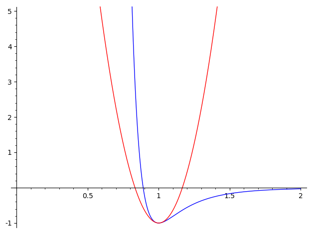
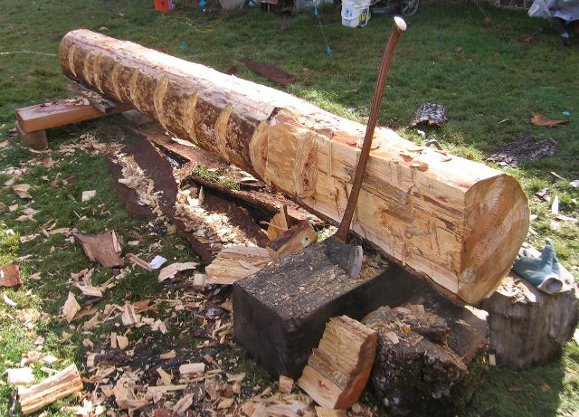
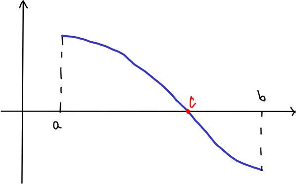
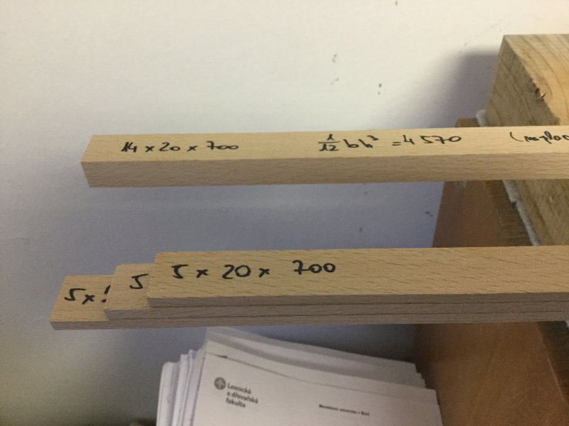
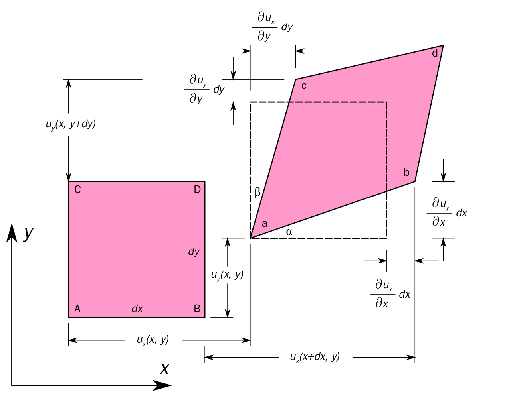

# Derivace a další užitečné nástroje

https://youtu.be/va5-0hR4tdQ

## Parita funkce

https://youtu.be/5vRoVfXUbvE

V následující definici se budeme zajímat o to, jestli existuje nějaký
vztah mezi funkční hodnotou v bodě $x$ z definičního oboru a v bodě
opačném.

```{prf:definition} Parita funkce
:nonumber:
   Nechť je pro funkci $f$ a libovolný bod $x$ definičního oboru definována kromě $f(x)$ i hodnota $f(-x)$.

* Řekneme, že funkce $f$ je *sudá*
pokud platí $f(-x)=f(x)$.
* Řekneme, že funkce $f$ je *lichá*
pokud platí $f(-x)=-f(x)$.
* Řekneme, že funkce $f$ má *paritu*, je-li
sudá nebo lichá.
```


\iffalse

<div class='obtekat'>


</div>

\fi

Graf sudé funkce je osově souměrný podle osy $y$.  Graf liché funkce
je středově souměrný podle bodu $[0,0]$.

U sudé funkce stačí mít algoritmus nebo tabulky pro kladné argumenty. Například kosinus je sudá funkce a platí $$\cos(-x)=\cos(x).$$ Analogicky pro funkci sinus jako pro lichou funkci platí $$\sin(-x)=-\sin (x).$$

```{prf:remark} Využití sudosti v materiálovém inženýrství
:nonumber:
 Funkční hodnoty sudé funkce jsou rozloženy symetricky podle osy $y$. Pokud víme, že úloha bude mít osově symetrické řešení, můžeme tuto znalost použít a hledat řešení mezi sudými funkcemi. Například při řešení prostupu tepla deskou, kdy stejný fyzikální proces probíhá na obou stranách desky, je přirozené modelovat jenom polovinu desky a uprostřed nastavit podmínku, která umožní sudé prodloužení do druhé poloviny. Většinou to bývá nulovost derivace. Proto se například při nestacionární difuzi používá v definici bezrozměrného času, který charakterizuje fyzikální proces, polovina tloušťky materiálu. Viz P. Horáček, Fyzikální a mechanické vlastnosti dřeva I nebo odpovídající [e-opora](https://is.mendelu.cz/eknihovna/opory/zobraz_cast.pl?cast=9180).
```


Sudé a liché funkce jsou, díky svým vlastnostem, v jistém smyslu
pěkné. V matematice se často snažíme zapsat nějaký objekt pomocí
podobných pěkných objektů. Uvidíme to později například při popisu
deformace. Jako ukázku přístupu si můžeme už teď ukázat následující
snadnou větu. Věta je teď asi málo užitečná, ale naučíme se na ní
trik, kterým později rozdělíme složitější objekt (matici) na součet
dvou jiných a šikovnějších objektů (součet symetrické a antisymetrické
matice).

```{prf:theorem} O rozkladu funkce na součet sudé a liché funkce
:nonumber:
 Platí $$f(x)=\frac{f(x)+f(-x)}2 + \frac{f(x)-f(-x)}2.$$
Každou funkci definovanou na $(-\infty,\infty)$ je možné takto rozložit na součet sudé a liché funkce.
```


**Příklad.** Pro funkci $f(x)=e^x$ dostáváme
$$e^x=\frac{e^x+e^{-x}}2+\frac{e^x-e^{-x}}2.$$ Dvě funkce na pravé
straně mají význam v aplikacích a nazývají se hypebolický kosinus,
$\cosh x$, a hyperbolický sinus, $\sinh x$.

**Příklad.** Je-li funkce $f(x)$ polynom, potom rozkladem na sudou a lichou část dostaneme polynomy, které jsou tvořeny členy původního polynomu tak, že sudá část obsahuje právě členy se sudým exponentem a lichá část právě členy s lichým exponentem.

### Využití parity při technických výpočtech

<div class='obtekat'>


</div>

Model tříbodového namáhání nosníku vykazuje dvě roviny symetrie: uprostřed (levá půlka je zrcadlem pravé) a uprostřed podélně podle svislé osy. Stačí tedy modelovat jenom čtvrtinu nosníku. To je výhoda. Protože dřevo je anizotropní materiál s nelineárními materiálovými vlastnostmi, trvá řešení modelu i na nejrychlejších počítačích dlouho a využití symetrie dokáže značně zkrátit čas výpočtu. Na obrázku nahoře je tříbodové namáhání nosníku modelované i s podporami použitými pro deformaci. Dole je zjednodušená situace, kdy nás zajímá jenom část mezi levou dolní a prostřední horní čelistí zkušebního stroje. Protože se jedná jenom o výřez, končí pravá strana poněkud nepřirozeně. Po zrcadlovém doplnění chybějící části nosníku se však obě poloviny spojí a výsledek bude odpovídat modelování celého nosníku. 

Na dvou obrázcích je barevně napětí ve vodorovném směru. Pokud bychom na přední stranu nakreslili vodorovné čárečky, souvisí toto napětí se silou, která se snaží tyto čárečky natáhnout (kladná hodnota, červená barva) nebo stlačit (záporná hodnota, modrá barva). Z popisu je jasné, že situace je symetrická. Z obrázku například vyčteme, která část je podél nosníku namáhána tahem a která tlakem a jak velká jsou tato tahová a tlaková napětí. Co je však důležité, pravá polovina je zrcadlovou kopií levé poloviny a proto není nutné zde výpočty opakovat. Výsledná funkce bude sudou funkcí proměnné $x$, pokud počátek soustavy umístíme do středu nosníku a osu $x$ orientujeme ve směru nosníku. 

Třetí obrázek znázorňuje smykové napětí v rovině $xz$, tj. v rovině boční stěny. Pokud bychom si na boční stěně nakreslili čtverečky, sledujeme tímto sílu, snažící se tyto čtverečky deformovat. Situace je opět symetrická, jako v zrcadle. Ale v tomto případě platí, že co se zkosí doprava se v zrcadle zkosí doleva a naopak. Proto se sledovaná veličina liší v levé a pravé půlce znaménkem. Bude popsána funkcí, která je lichou funkcí proměnné $x$. Stačí vypočítat levou půlku a podle ní doplnit půlku pravou.

Pro zajímavost: u dřeva jako nelineárního anizotropního materiálu je nutné před výpočtem rozhodnout, na kolik elementů se během výpočtu těleso rozdělí a při výpočtu postupně zvyšovat zatížení, sledovat poměry v každém kousku tělesa a rozhodovat, kdy se dostaneme mimo platnost Hookova zákona pro deformaci a přepneme v daném místě na nelineární chování. Proto výpočet trvá cca 20 minut nebo 40 minut (podle velikosti elementů, na které se těleso rozdělí). Oproti tomu výpočet například s ocelí trvá řádově vteřiny, protože úloha je lineární, izotropní, dá se vypočítat hned konečný stav a je možné během výpočtu zmenšovat velikost elementů jenom v místech, kde to je nutné. U dřeva výpočet jedné čtvrtiny modelu výrazně pomůže, závislost doby výpočtu na složitosti dokonce není lineární. Výpočet čtvrtinového modelu trvá výrazně kratší dobu než je čtvrtina doby pro výpočet celého modelu.

## Lokální extrémy

https://youtu.be/E1XxOQDtto0

### Motivace: Jak najít minimum potenciálu?

\iffalse

<div class='obtekat'>



</div>

\fi

V příkladě s aproximací potenciálu pomocí Taylorova polynomu se nám
povedlo potenciál aproximovat pomocí kvadratické funkce v okolí
vrcholu paraboly. To je častá úloha, protože systémy s potenciální
energií se často nacházejí ve stavu blízkému minimu této
energie. Otázka je, jak toto minimum najít. Budeme řešit poněkud
obecnější úlohu, jak hledat nejenom minimální hodnotu, ale i maximální
hodnotu. Zaměříme se na minima a maxima, která jsou lokální (s funkcí pracujeme
pouze na určitém intervalu, třeba i krátkém). 

### Lokální extrémy spojitých funkcí

Následující definice si všímají bodů které mají tu vlastnost, že v okolí není možné najít body buď s vyšší funkční hodnotou (potom se jedná o lokální maximum, nikde v okolí mi funkce neukáže více) nebo s nižší funkční hodnotou (analogicky, lokální minimum).

```{prf:definition} Lokální extrémy
:nonumber:
Nechť $f\colon \mathbb R\to\mathbb R$.

* Řekneme, že $f$ má v bodě $x_0$ *lokální maximum*, pokud platí $$f(x)\leq f(x_0)$$ pro všechna $x$ z nějakého okolí bodu $x_0$.
* Řekneme, že $f$ má v bodě $x_0$ *lokální minimum*, pokud platí $$f(x)\geq f(x_0)$$ pro všechna $x$ z nějakého okolí bodu $x_0$.
* Řekneme, že $f$ má v bodě $x_0$ *lokální extrém*, pokud v tomto bodě má buď lokální maximum nebo lokální minimum.
```


Přímo z definice lokálních extrémů a rostoucí a klesající funkce plyne, že funkce nemůže mít lokální extrém v bodě, kde je rostoucí nebo kde je klesající. Tuto skutečnost vyjadřuje pomocí derivací následující věta.

```{prf:theorem} Fermatova věta o lokálním extrému, nutná podmínka pro lokální extrém
:nonumber:
Má-li funkce $f$ v bodě $x_0$ lokální extrém, potom je derivace funkce $f$ v bodě $x_0$ nulová, nebo neexistuje. 
```

Předchozí věta představuje *nutnou podmínku* pro lokální extrém. V bodě kde není splněna (tj. pokud je derivace v tomto bodě kladná nebo záporná) extrém nemůže nastat. Tím je eliminováno obrovské množství bodů z definičního oboru funkce. V prakticky využitelných případech nám po této eliminaci často zůstane jenom jediný bod, podobně jako v následující úloze. 

### Příklad: Nosník maximální tuhosti

\iffalse

<div class='obtekat'>





</div>

\fi

**Příklad.** Z kulatiny o průměru $d$ chceme získat nosník
obdélníkového průřezu, který se při zatížení co nejméně prohýbá. Z
fyzikálních úvah víme, že musí být maximální součin $wh^3$, kde $w$
je šířka a $h$ výška nosníku.

*Trik 1: Budeme měřit jednotky v násobcích průměru.* Proto je
$d=1$. Můžeme tedy bez újmy na obecnosti předpokládat, že kulatina má
jednotkový průměr.

Z Pythagorovy věty (nakreslete si průřez, tj. obdélník vepsaný do
kružnice) plyne $w=\sqrt{1-h^2}$ a snažíme se tedy řešit úlohu
$$wh^3=h^3 \sqrt{1-h^2}\to \mathrm{MAX},$$
která má fyzikální smysl na intervalu $(0,1)$.

*Trik 2: Protože uvažujeme jenom 
kladné délky, je funkce kladná a bude maximální tam, kde bude
maximální její druhé mocnina.* Je tedy možné studovat ekvivalentní
úlohu
$$(wh^3)^2=h^6(1-h^2)=h^6-h^8\to \mathrm{MAX}$$
na intervalu $(0,\infty)$. Výhoda je zřejmá: místo součinu dvou
funkcí, z nichž jedna je navíc složená, studujeme dvoučlenný
polynom. Pro funkci $$f(h)=h^6-h^8$$ dostáváme
$$ \frac{\mathrm df}{\mathrm dh}=6h^5-8h^7=2h^5(3-4h^2).$$
Tato derivace je nulová pro 
$$h^2=\frac 34$$
tj. $$h=\frac{\sqrt 3}2.$$ Pro tuto výšku bude mít nosník maximální
hodnotu tuhosti. Šířka nosníku bude
$$w=\sqrt{1-h^2}=\sqrt{1-\frac 34}=\sqrt{\frac 14}=\frac 12.$$
Poměr výšky a šířky u nosníku maximální tuhosti tedy bude $\sqrt{3}:1$
a šířka bude rovna polovině průměru.

[Online výpočet.](https://sagecell.sagemath.org/?z=eJwrSyzSUM9QSFHX5OVK08jQtM2IM9YqLiwq0UiJM9LNiDMCihdn5JdrpOmlZKaBVGAI6BXn55SlgmQAYWkWzQ==&lang=sage)

## Postačující podmínka pro lokální extrém

https://youtu.be/W7Kf-waoHQE

Pokud řešíme úlohu s praktickým zadáním, je z povahy úlohy často
zřejmé, že lokální extrém požadovaného typu existuje a často to bývá
jediný bod, kde je derivace nulová. V takovém případě pro identifikaci
lokálního extrému stačí nutná podmínka. Pokud bodů vyhovujících nutné
podmínce máme více, nebo pokud je situace méně zřetelná, můžeme
existenci lokálního extrému posoudit pomocí následující věty. Ta
představuje *dostatečnou (postačující) podmínku* pro lokální
extrém. Stačí aby tato podmínka byla splněna a můžeme s jistotou
usoudit, že v bodě je extrém a jaký.

```{prf:theorem} Postačující podmínka pro lokální extrémy
:nonumber:
 Je-li $f$ spojitá v bodě $x_0$ a mění-li se v bodě $x_0$ funkce $f$ z rostoucí na klesající, má funkce $f$ v bodě $x_0$ lokální maximum. Analogicky, lokální minimum nastává při změně z klesající na rostoucí.
```


Podle této věty jsou intervaly monotonie zásadní informací pro
nalezení lokálních extrémů. Vzhledem k souvislosti monotonie s
derivací je tedy nutné se věnovat nalezení intervalů, kde má funkce
kladnou derivaci a intervalů, kde má funkce zápornou derivaci.

### Bolzanova věta

<div class='obtekat'>



</div>

Pro nalezení intervalů, kde je výraz závislý na jedné proměnné kladný
a kde záporný je vynikajícím nástrojem Bolzanova věta představená v
následujících odstavcích. Hodí se například pro nalezení intervalů,
kde má funkce kladnou a kde zápornou derivaci, což využijeme při
nalezení intervalů, kde je funkce rostoucí a kde klesající.

Bolzanova věta je poměrně názorné tvrzení. Hlavním přínosem pražského
matematika Bernarda Bolzana bylo, že si uvědomil, že toto tvrzení není
snadným důsledkem definice spojitosti a že přes názornost tohoto
tvrzení je nutno podat jeho přesný důkaz, který rozhodně není
jednoduchý. Jiná, zdánlivě nevinná tvrzení, však pravdivá být
nemusí. Zde se nabízí souvislost se spojitostí funkce a nakreslitelností jedním tahem. Bolzano například našel funkci, která je spojitá, ale její
graf je tak komplikovaný, že se nedá nakreslit.

Podmínka $f(a)f(b)<0$ v následující větě znamená, že funkční hodnoty
funkce $f$ v bodech $a$ a $b$ se liší znaménkem.

```{prf:theorem} Bolzanova věta
:nonumber:
 Nechť $f$ je spojitá funkce na intervalu $[a,b]$ a $f(a)f(b)<0$. Potom existuje $c$ na intervalu $(a,b)$ takové, že platí $f(c)=0.$
```


**Důsledek.**

* Na intervalu, kde je funkce spojitá a různá od nuly, se zachovává
znaménko funkce, tj. funkce je zde buď pořád kladná nebo pořád
záporná. Mezi oběma variantami se můžeme rozhodnout testováním
znaménka funkce v jednom libovolném bodě intervalu.
* Na intervalu, kde má funkce spojitou a od nuly různou derivaci, se
zachovává monotonie funkce, tj. funkce je zde buď pořád rostoucí nebo
pořád klesající. Mezi oběma variantami se můžeme rozhodnout testováním
monotonie (tj. znaménka derivace) v jednom libovolném bodě intervalu.

**Poznámka.** Lokální extrém nastává tam, kde je funkce spojitá a kde
se mění monotonie. Nenastává tam, kde se monotonie spojité funkce
nemění. Přirozeně nenastává ani tam, kde funkce není definována.

**Příklad.** Najděte lokální extrém funkce $y=\frac x{x^2+1}$. Derivace je $y'=\frac{(1+x)(1-x)}{(x^2+1)^2}$. 

**Příklad.** Najděte lokální extrém funkce $y=\frac{x^3}{x+2}$. Derivace je $y'=\frac{2(x+3)x^2}{(x+2)^2}$.

### Příklad: kritická tloušťka izolace trubky

<div class="shorten" data-text="Využití derivace hledání lokálního extrému funkce.">

\iffalse

<div class='obtekat'>


</div>

\fi

Následující příklad je poněkud překvapivý. Představme si, že
potřebujeme obalit horkou trubku izolací, abychom snížili tepelné
ztráty. Izolace se zahřeje od trubky a vyzařuje teplo do
okolí. Vyzářené teplo je úměrné rozdílu teploty povrchu izolace a
teploty vnějšího okolí a také plošnému obsahu povrchu izolace (větší
plocha více vyzáří). Roli hraje i kvalita povrchu, to je skryto v
příslušné konstantě úměrnosti. S daným materiálem potřebujeme tedy u
izolace dosáhnout toho, aby její teplota a povrch byly co
nejmenší. Teplotu snížíme, pokud uděláme izolaci silnější, to ovšem
zvýší její povrch. A z většího povrchu se vyzáří více tepla. Přidávání
izolace by tedy mohlo být kontraproduktivní. Zdá se to být proti
logice, ale logika nás někdy může zavést na zcestí a stojí za to jev
prozkoumat.

Nejprve ukážeme, že přidávání izolace opravdu může zvýšit tepelné
ztráty, ale potom se uklidníme tím, že v praktickém životě, například
při izolování topenářských trubek, tento problém nemáme. Potřebujeme
dva vzorce, které dodá fyzika, poté již budeme pracovat čistě
matematicky.

Teplo $Q$, které projde za jednotku času při ustáleném vedení tepla povrchem trubky délky $L$ o vnitřním poloměru $r$, vnějším poloměru $R$ je dáno vztahem 

$$\frac Q{2\pi Lk} \ln \frac{R}{r}=T_1-T_2,$$(3.1) 

kde $T_1$ je teplota uvnitř, $T_2$ teplota na vnějším okraji a $k$ je tepelná vodivost materiálu. Tento vzorec odvodíme později v přednášce o integrálu. 

Teplo $Q$, které za jednotku času vyzáří plocha trubky o poloměru $R$ a teplotě $T_2$ do okolí o teplotě $T_\infty$, vztažené na jednotku povrchu trubky, je přímo úměrné rozdílu teplot a povrchu, tj. platí $$\frac{Q}{2\pi  R L}=h (T_2-T_\infty).$$ Odsud

$$\frac Q{h 2\pi RL}= T_2-T_\infty.$$ (3.2)

Sečtením {eq}`3.1` a {eq}`3.2` dostaneme 
$$ \frac{Q}{2\pi L}\left(\frac 1k \ln \frac{R}{r}+\frac 1{h R}\right) = T_1-T_\infty.$$
Tento vzorec popisuje tepelné ztráty při izolaci trubky o vnitřním poloměru $r$ a teplotě $T_1$ izolací o vnějším poloměru $R$ ve vnější teplotě $T_\infty$. Parametry izolace jsou tepelná vodivost $k$ a s koeficient prostupu tepla $h$. Budeme sledovat, jak se chová veličina $Q$ (tepelné ztráty) jako funkce proměnné $R$. 
$$Q(R)=2\pi L\frac {T_1-T\infty}{\frac 1k \ln \frac{R}{r}+\frac 1{h R}}$$
Pokud chceme minimalizovat tepelné ztráty $Q$, musíme maximalizovat jmenovatel
$$f(R)=\frac 1k \ln \frac{R}{r}+\frac 1{h R}=\frac 1k \ln R -\frac 1k \ln r+\frac 1{h} R^{-1}.$$
Ostatní veličiny jsou totiž konstantní. 
Platí 
$$\frac {\mathrm d f}{\mathrm dR}=\frac 1k \frac 1R+\frac 1h (-1)R^{-2} =\frac {Rh-k}{khR^2}.$$
Derivace je nulová pro $$R=\frac kh$$ a v okolí tohoto bodu mění
znaménko ze záporného na kladné. Proto má funkce $f(R)$ v tomto bodě
minimum. To odpovídá maximu funkce $Q$. Hodnota $R=\frac kh$ tedy
odpovídá maximu funkce tepelných ztrát $Q$. Pro menší poloměr izolace
přidávání další izolace paradoxně zvyšuje tepelné ztráty. Nazývá se *kritický poloměr izolace*.

[Online graf funkce](https://sagecell.sagemath.org/?z=eJw1jkuOgzAQRPdI3KGlLGIzngDZc4JkM4h91CGOaOzYlmMswemnmc-upH6vqg8w6KCt07CliGmFEAlo89ZndAQpLnezwozGw3NxZtSQnZ7fNHkIDL10XH5wHPWpLA5wyWgpYaLMdmBbTwoccqux-ICkg_UJYdbAqnYIma9vfx9pnCD67UF2gb3ol1z_P0DwxlvijbIYbq0abuSeae1a1ZRFVFcObVkYNXXnPWSM4tgfZVl8iV525ypQda0Em59_pqxFW5vKOtHXUX60tZiqXrKwz4rdUqJXzYnrGqnWF7mukd96J18r&lang=sage&interacts=eJyLjgUAARUAuQ==)

\iffalse

<div class='obtekat'>


</div>

\fi

Při použití běžných materiálů pro izolaci vodovodních a topenářských
trubek je kritický poloměr tak malý, že při praktické realizaci s
ním nemusíme pracovat a materiál se chová dle očekávání, tj. více
izolace znamená menší ztráty.

Inženýr, který má navrhnout izolaci elektrického vodiče ovšem vidí
problém trochu jinak. Potřebuje naopak tepelné ztráty maximalizovat
aby se vodič zbavoval tepla vytvořeného průchodem elektrického
proudu. Proto by izolace neměla překročit kritický poloměr.

</div>

## Odbočka: triky pro práci s funkcemi 1

1. Vhodnou volbou jednotek dokážeme eliminovat některé
parametry. Přesněji, vhodnou volnou jednotek dokážeme některým
parametrům dát konkrétní numerickou hodnotu. Vyšetřovaná funkce je
potom často jednodušší. Viděli jsme v příkladě s vytesáním nosníku maximální tuhosti z kulatiny. 
1. Je-li $g$ rostoucí, potom z definice rostoucí funkce plynou ekvivalence
$$
\begin{gathered}
  f(x)\leq f(x_0) \iff   g(f(x))\leq g(f(x_0)),\\
    f(x)\geq f(x_0) \iff   g(f(x))\geq g(f(x_0))
\end{gathered}
$$
a proto funkce $f(x)$ a $g(f(x))$ mají lokální extrémy ve stejných
bodech. Toho je možné využít, pokud vidíme, že při vhodné volbě funkce
$g$ by byla funkce $g(f(x))$ vhodnější pro hledání lokálních
extrémů. Viděli jsme v příkladě s vytesáním nosníku maximální tuhosti z kulatiny. 
1. Podobně jako v předchozím bodě je možné uvažovat i klesající funkce
$g$. Ale protože klesající funkce obrací směr nerovností, mění se
lokální maximum na lokální minimum a naopak. 
$$
\begin{gathered}
  f(x)\leq f(x_0) \iff   g(f(x))\geq g(f(x_0)),\\
    f(x)\geq f(x_0) \iff   g(f(x))\leq g(f(x_0))
\end{gathered}
$$
Viděli jsme v příkladě s
tepelnými ztrátami tepelně izolovaných trubek. Zde jsme využili toho,
že zúžení funkce $\frac 1x$ na kladná čísla je klesající.

<!--

Dva útvary jsou podobné, jestli jeden vznikne z druhého zvětšením všech délek na jejich $k$-násobek. Pro $k$-krát zvětšený útvar platí, že všechny jeho rozměry jsou $k$-krát větší, všechny jeho plochy jsou $k^2$-krát větší a všechny jeho objemy jsou $k^3$-krát větší. Podobné útvary jsou vždy definovány jedním parametrem, například u kruhu a koule stačí zadat poloměr. U krychle stačí zadat délku jedné strany nebo délku stěnové uhlopříčky nebo délku tělesové uhlopříčky. U válce, který má stejnou výšku jako průměr podstavy stačí zadat výšku nebo poloměr podstavy. U kužele s vrcholovým úhlem $45^\circ$ stačí zadat výšku nebo poloměr podstavy a je tím dán celý kužel. U takových těles platí pro jakýkoliv povrch (povrch koule, povrch kužele, povrch pláště kužele, povrch válce, povrch válcové plochy, ...)
$$S=k_1r^2$$ a pro jakýkoliv objem
$$V=k_2r^3,$$ kde $k_1$ a $k_2$ jsou konstanty a $r$ vhodný délkový parametr.  Tyto konstanty mají dokonce pěknou interpretaci - odpovídají obsahu nebo objemu pro $r=1$ a ve většině případů je známe, protože například pro kouli nebo kužel máme přesný vzorec založený na poloměru.
Díky tomuto je dokonce možné snadno najít vztahy mezi objemem a povrchem $$V=k_3 S^{3/2}$$ a $$S=k_4 V^{2/3}.$$ Tyto vztahy je snadné si pamatovat, stačí se řídit tím, že mocnina musí být taková, aby vycházely správné jednotky. Metodami středoškolské matematiky dokonce dokážeme dokonce konstanty $k_1$ až $k_4$ najít pro jednotlivá tělesa jako je koule apod. Často nás však přesná hodnota konstanty nezajímá a jde nám jenom o charakter funkční závislosti, o přímou úměrnost mezi vhodnými mocninami. Vztahy stejného typu platí například i pro kužel s konstantním úhlem u vrcholu. To je možné využít při skladování sypkého materiálu (písek nasypaný na hromadu zaujme tvar kužele, úhel u vrcholu je daný vlastnostmi písku) nebo vyprazdňování nádrže ve tvaru trychtýře. Podobnost nacházíme i v živé přírodě, výrazná je například u ryb, kdy velká ryba je často tvarově blízká zvětšené malé rybě (viz S. Vogel, Comparative biomechanics, kap. 3). Formálně je podobné úvahy možno zobecnit pomocí [Buckinghamova Pi-teorému](http://geo.mff.cuni.cz/seismosoft/Pi-teorem.pdf).

-->

## Buckinghamův $\Pi$-teorém

https://youtu.be/C4_3IbbLpiI

\iffalse

<div class='obtekat'>


</div>

\fi

Naučíme se, že některé vztahy mezi veličinami se dají určit z
fyzikálních jednotek těchto veličin.

Existují tělesa, která jsou závislá jenom na jednom délkovém parametru
a pokud tento délkový parametr zvětšíme $k$-krát, povrchy a obsahy na
tomto tělese se zvětšují $k^2$-krát a objemy $k^3$-krát. To je princip
známý z elementární matematiky jako podobnost. Proto objem koule o
poloměru $r$ je objem koule o jednotkovém poloměru vynásobený faktorem
$r^3$ a analogické tvrzení platí i pro krychli. Podobnost nacházíme i
v živé přírodě. Výrazná je například u ryb, kdy velká ryba je často
tvarově blízká zvětšené malé rybě (viz S. Vogel, Comparative
biomechanics, kap. 3). V technických aplikacích najdeme stejný princip
u skladování sypkého materiálu (písek nasypaný na hromadu zaujme tvar
kužele, úhel u vrcholu je daný vlastnostmi písku) nebo vyprazdňování
nádrže ve tvaru trychtýře (tekutina má tvar kužele s úhlem u vrcholu
daným trychtýřem).

Rozšíření myšlenky podobnosti je rozměrová analýza. Ta je založená na poznatku,
že fyzikální zákony je možno vyjadřovat v různých jednotkách. Formální
postup umožňuje například následující věta.

```{prf:theorem} Buckinghamův Pi-teorém
:nonumber:
 Rovnici $$F_0(x_1,x_2,\dots,x_n)=0,$$ resp. $$x_1=F(x_2,\dots,x_n),$$ která vyjadřuje fyzikální zákon a obsahuje
$n$ veličin (včetně fyzikálních a materiálových konstant) vyjádřených pomocí $m$ základních
jednotek je možno zapsat jako rovnici vyjádřenou pomocí $(n-m)$
bezrozměrných parametrů, tj. $$f_0(\pi_1,\pi_2,\dots,\pi_{n-m})=0,$$
nebo
$$\pi_1=f(\pi_2,\dots,\pi_{n-m}).$$
```


Formální tvar a metoda výběru bezrozměrných parametrů jsou v tuto
chvíli pro nás poměrně komplikované a proto bude nejjednodušší si
problematiku ukázat na příkladech. Jejich hlavním smyslem je to, že
vztah mezi veličinami odhalíme (až na detaily typu multiplikativní
konstanta) jenom z fyzikálních jednotek, bez hlubší znalosti
fyzikálního pozadí. Stačí identifikovat relevantní parametry.

**Příklad (vztah mezi rychlostí, dráhou a dobou u pohybu konstantní rychlostí).** U pohybu konstantní rychlostí jsou relevantní parametry rychlost $v$ v kilometrech za hodinu, doba $t$ v hodinách a dráha $s$ v kilometrech. To jsou tři veličiny vyjádřené pomocí dvou základních jednotek. Existuje tedy jediná bezrozměrná veličina, pomocí které je možno zapsat souvislost mezi parametry pohybu. Tu je možno sestavit jediným možným způsobem (až na případné mocniny) a to ve tvaru $$\pi_1=\frac{vt}{s}.$$ Podle Buckinghamova teorému tato veličina musí být konstantní, tj. musí platit $\frac{vt}{s}=k$ pro nějakou konstantu $k$. Prozkoumáním modelového případu, kdy rychlost, dráha i čas jsou jednotkové, vidíme, že konstanta musí být rovna jedné a proto platí $$\frac{vt}{s}=1.$$ Odsud již snadno nalezneme $v=\frac{s}{t}$ a další variace vzorce pro rovnoměrný pohyb tak jak je známe ze základní školy.

**Příklad (vztah mezi objemem a povrchem koule).** Pro nalezení
přepočtu mezi objemem koule $V$ (v metrech krychlových) a povrchem
koule $S$ (v metrech čtverečních) máme $n=2$ (veličiny $S$ a $V$) a
$m=1$ (jediná základní jednotka metr). Tedy platí $n-m=1$ a vztah se
dá zapsat pomocí jedné bezrozměrné veličiny. Pro tuto veličinu
existuje jenom jediná možná varianta: $\pi_1=V^2 S^{-3}$. Potom je
funkce $f$ konstantní a pro nějakou hodnotu $k$ platí $$V^2 S^{-3}=k$$
a odsud $$V^2=k S^{3}.$$ Tedy vhodné mocniny objemu a obsahu jsou si
úměrné. Tento výsledek je možné získat i kombinací vzorců $V=\frac 43
\pi r^3$ a $S=4\pi r^2$, ovšem je nutná znalost těchto vzorců a
provedení netriválního množství matematických výpočtů. Jako výsledek
takové detailnější analýzy bychom navíc věděli, jaká je hodnota
konstanty úměrnosti $k$. My jsme si však chtěli ukázat dosažení
výsledku s minimální námahou a s minimálními vstupními znalostmi,
abychom podobný postup mohli používat i v jiných případech, kdy
alternativní postup nemáme k dispozici.

\iffalse

<div class='obtekat'>




</div>

\fi

**Příklad (tuhost nosníků čtvercového a kruhového průřezu).** Veličinou ovlivňující tuhost nosníku při
daném materiálovém složení je kvadratický moment průřezu $I$ v
jednotkách metr na čtvrtou. Pokud je průřez nosníku daný jenom jedním
délkovým parametrem $a$ (například čtvercový nebo kruhový průřez),
máme stejný případ jako výše, kdy počet parametrů o jedničku převyšuje počet základních jednotek: $n=2$ a $m=1$. Vztah mezi
kvadratickým průřezem $I$ a rozměrem $a$ se dá vyjádřit pomocí jedné bezrozměrné veličiny a  máme vlastně jenom jedinou možnost jako tuto veličinu sestavit: $$\pi_1=\frac {I}{a^4}.$$ Stejně jako v předchozím
příkladě existuje konstanta $k$ taková, že $\frac I{a^4}=k,$ tj. $$I=ka^4.$$ Po seznámení se
s dvojným integrálem uvidíme, že pro čtvercový průřez o straně čtverce
$a$ je $k=\frac 1{12}.$

**Příklad (tuhost nosníků obdélníkového průřezu).** Budeme pokračovat
v předchozím příkladě. Pro obdélníkový průřez o rozměrech $w$ krát $h$
je $m=3$ (tři veličiny $w$, $h$, $I$) a $n=1$ (jediná základní
jednotka metr). Pokud však víme, že dva nosníky vedle sebe se
prohýbají stejně, jako by byly spojeny, víme, že mezi $I$ a $w$ musí
být přímá úměrnost. Proto můžeme místo kvadratického momentu průřezu
pracovat s kvadratickým momentem na jednotku šířky $\frac Iw$ v
jednotkách metr na třetí a potom stejně jako v minulém případě
existuje konstanta $k$ taková, že $\frac Iw=kh^3,$ tj. $$I=kwh^3.$$ To
je přesně v souladu s tvrzením, které jsme použili v příkladu s
maximalizací tuhosti nosníku obdélníkového průřezu, kdy jsme tvrdili,
že mírou tuhosti je součin $wh^3$.

Pokud více nosníků pokládáme na sebe nebo vedle sebe, tuhost se
sčítá. Pokud nosníky vedle sebe slepíme bočními hranami, nic se
nezmění, protože na spoji není žádné tahové napětí. Tuhost tedy roste
lineárně s šířkou. Pokud tři nosníky položíme na sebe, vzroste tuhost
na trojnásobek jednoho nosníku.  Tuhost nosníku však také roste se
třetí mocninou výšky.  Nosníky položené na sebe a slepené se chovají
jako jediný nosník. Pokud tři nosníky slepíme nebo spojíme hřebíky,
vzroste tuhost $3^3$-krát, tj. 27-krát v porovnání s jediným
nosníkem. Tři spojené nosníky mají tedy devítinásobnou tuhost v
porovnání se třemi na sobě volně položenými.

## Vektorové funkce, gradient

https://youtu.be/trdMQ6WOGlk

Výstupem vektorové funkce je vektor. Vstupem je buď reálné číslo (funkce jedné proměnné), nebo vektor. V prvním případě se jedná o parametrickou křivku v [rovině](https://sagecell.sagemath.org/?z=eJxTVghILErMTS0pykzOrlSoSkxJzEtUyC7KLMtO5OXi5SqxLUss0lAvUdfk5SqAq4wvyMkv0YhOzi_WKNHUUSjOzAPSsToKGgY6BZmamgDCkhs_&lang=sage&interacts=eJyLjgUAARUAuQ==) nebo v [prostoru](https://sagecell.sagemath.org/?z=eJxTVghILErMTS0pykzOrlSoSkxJzEtUyC7KLMtO5OXi5SqxLUss0lAvUdfk5SqAq4wvyMkvMU7RiC7RSs4v1ijR1FEo0SrOzAOxSmJ1FDQMdMy0CjI1NQHngx4S&lang=sage&interacts=eJyLjgUAARUAuQ==), ve druhém případě bývá zpravidla na vstupu stejný počet veličin jako na výstupu a jedná se o vektorové pole (každému bodu v rovině je přiřazen [rovinný vektor](https://sagecell.sagemath.org/?z=eJyr0KnUqbItSyzSUK9QqFSoUtfk5SrIyS-JL0tNLskvik_LTM1J0dDQrdSp0NRR0KjQ0TXUMQSxKqGsxOICoMr4osSSzHxbQ00A7BcYPA==&lang=sage&interacts=eJyLjgUAARUAuQ==) nebo každému bodu v prostoru je přiřazen prostorový vektor). Vektory zapisujeme pomocí jejich komponent následovně.
$$\vec F=(P,Q,R)=P\vec i+Q\vec j+R\vec k = P\vec e_1+Q\vec e_2+R\vec e_3$$

### Gradient

Pokud nerovnoměrnost v prostorovém rozložení skalární veličiny iniciuje nějaký děj, je nutné znát směr, ve kterém tato veličina roste nebo klesá. To jsme viděli například u rovnice vedení tepla, kde nerovnoměrnost v prostorovém rozložení teploty dává vznik toku tepla. V jednorozměrném případě byla situace jednoduchá a stačí se řídit znaménkem derivace. Ve dvourozměrném nebo trojrozměrném případě je bohužel situace složitější ale i zde máme nástroj pro detekci směrů ve kterém veličina roste nebo klesá a také intenzity tohoto růstu nebo poklesu.

```{prf:definition} Gradient
:nonumber:
 Buď $f(x,y)$ funkce dvou proměnných, která má
parciální derivace. *Gradientem* funkce $f$ rozumíme
vektor
$$\nabla f:=\left(\frac{\partial f}{\partial
    x},\frac{\partial f}{\partial y}\right).$$
```


**Poznámka.** Formálně též často píšeme
$$\left(\frac{\partial}{\partial x},\frac\partial{\partial y}\right)f,$$
kde
$\nabla=\left(\frac{\partial}{\partial x},\frac\partial{\partial
    y}\right)$ je operátor, se kterým pracujeme jako s
vektorem. Nazývá se *nabla* nebo *Hamiltonův operátor*. 

```{prf:remark} Fyzikální význam gradientu
:nonumber:
 Gradient skalární veličiny $f$ je vektorová veličina, která vyjadřuje směr a intenzitu maximálního růstu veličiny $f$. Přesněji, výsledkem gradientu je vektor ve směru maximálního růstu veličiny $f$. Délka tohoto vektoru je nárůst veličiny $f$ na intervalu jednotkové délky. Pro rovnoměrně rozloženou veličinu  v prostoru (konstantní) je gradient nulový. Proto je možné gradient chápat jako míru nerovnoměrného rozložení veličiny v prostoru. Řada fyzikálních dějů probíhá tak, že tato nerovnoměrnost vyvolá proudění, které se snaží tuto nerovnoměrnost vyrovnat, například vedení tepla nebo difuze. V praxi nás proto většinou zajímá směr maximálního poklesu, tj. $-\nabla f$.
```


### Lineární aproximace rovinné transformace

<div class="shorten" data-text="Derivace a lineární aproximace funkce více proměnných. Využívá se například při popisu deformace">

Následující pasáže jsou motivací pro tematický celek, kterému se
začneme věnovat na další přednášce.

<div class='obtekat'>



</div>

Rozšiřují lineární aproximaci na případ, kdy chceme
popsat transformaci roviny. Protože v tomto případě pracujeme se dvěma
souřadnicemi, je nutno uvažovat dvě funkce (pro každou souřadnici
jednu funkci) a každá funkce závisí na dvou proměnných (na obou
souřadnicích). Popis, který si představíme, využijeme při popisu
matematického namáhání při odvození veličin, na nichž je založen obecný
Hookův zákon dávající do souvislosti deformaci materiálu a působení
vnější síly.

Lineární aproximaci funkce jedné proměnné můžeme zapsat ve tvaru
$$f(x+\Delta x)\approx f+\frac{\mathrm df}{\mathrm dx}\Delta x,$$
kde na pravé straně pro stručnost nevypisujme závislost na
$x$. Podobně můžeme zapsat lineární aproximaci pro funkci dvou
proměnných $x_{1}$ a $x_{2}$ ve tvaru
$$
f(x_{1}+\Delta x_{1}, x_{2})\approx f +\frac{\partial f}{\partial x_{1}},\qquad
f(x_{1}, x_{2}+\Delta x_{2})\approx f +\frac{\partial f}{\partial x_{2}}.
$$

Uvažujme nyní mechanické namáhání, kdy se těleso posunuje, rotuje a
deformuje vlivem působení vnější síly a bod $(x_{1}, x_{2})$ se
posune o $(u_{1}(x_{1},x_{2}),u_{2}(x_{1},x_{2})).$
Pomocí lineárních
aproximací
$$
\begin{aligned}
  u_{1}(x_{1}+\Delta x_{1}, x_{2}+\Delta x_{2})&\approx u_{1}+\frac{\partial u_{1}}{\partial x_{1}}\Delta x_{1}+\frac{\partial u_{1}}{\partial x_{2}}\Delta x_{2}\\
  u_{2}(x_{1}+\Delta x_{1}, x_{2}+\Delta x_{2})&\approx u_{2}+\frac{\partial u_{2}}{\partial x_{1}}\Delta x_{1}+\frac{\partial u_{2}}{\partial x_{2}}\Delta x_{2}
  \end{aligned}
$$
dostáváme aproximace této transformace. Při
transformaci ve $3D$ je situace podobná, jenom jsou zde další členy
od třetích souřadnic. Aby se situace nestala nepřehlednou, je klasický
způsob zápisu neudržitelný. Nástroj pro přehlednou formulaci lineární
aproximace dostaneme k dispozici později po probrání maticového počtu
a maticového násobení. Poté budeme díky lineární aproximaci schopni
zformulovat souvislost mezi deformací a působením vnější síly.

Za výše uvedenou lineární aproximaci však platíme jistou daň. Lineární
zobrazení mimo jiné transformuje přímky na přímky, rovnoběžky na
rovnoběžky, střed úsečky na střed úsečky. Deformaci, která tyto
podmínky nesplňuje, tím pádem nemůžeme podchytit. Lineární aproximace
je přesná jenom pro relativně malé deformace. Proto se také výsledný
produkt, ke kterému se v průběhu semestru dopracujeme, nazývá tenzor
malých deformací.

</div>

## Shrnutí, hlavní myšlenky

\iffalse

<div class='obtekat'>


</div>

\fi

* Derivace dokáže detekovat růst a klesání funkce a díky tomu dokážeme také detekovat body, kde se růst zastaví a změní na klesání nebo naopak. Tyto body nás přirozeně zajímají, protože v těchto bodech je studovaná veličina maximální nebo minimální a to má dopad při minimalizaci nákladů, maximalizaci pevnosti či zisku a jiných úlohách z praktického života.
* Silným nástrojem dokáží být i jednodušší postupy, jako například rozměrová analýza reprezentovaná Buckinghamovým $\Pi$ teorémem.

